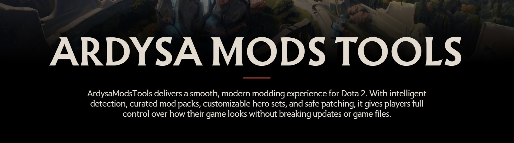
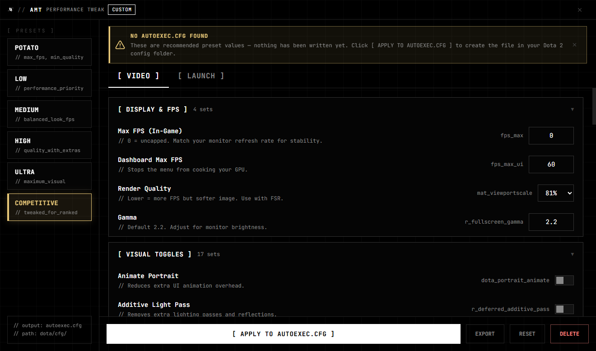

# ArdysaModsTools

**The one-click cosmetic mod manager for Dota 2.**
Install, customize, and safely revert client-side skins, terrains, HUDs, and more.

     

---

[Preview](#-preview) · [Features](#-features) · [Safety](#-safety--reliability) · [Install](#-installat
ion) · [Quick Start](#-quick-start) · [How It Works](#-how-it-works) · [Docs](#-documentation) · [FAQ](
docs/user/FAQ.md) · [Website](https://ardysamods.my.id)

> [!CAUTION]
> Not affiliated with Valve or Steam. All mods are **client-side only** no one else sees them. Modifying game files can violate Valve's Terms of Service. **Use at your own risk.**

## 📖 Overview

**ArdysaModsTools (AMT)** is a Windows desktop app for managing client-side cosmetic mods in Dota 2 hero skins, terrains, weather, HUDs, couriers, music, and performance tweaks. It writes only local files, verifies every download, and lets you return to the vanilla game at any time with a single click.

The UI is a clean monochrome shell rendered through an embedded WebView2 view, consistent with [ardysamods.my.id](https://ardysamods.my.id).

## 🎬 Preview

## ✨ Features

| Feature | What it does |
| :--- | :--- |
| **One-Click ModsPack** | Download and apply the full curated community mod pack in one click. |
| **Skin & Persona Selector** | Browse hero sets, individual items (with slot-based mutual exclusion), Personas, and Prismatic overlays in an interactive gallery. |
| **Miscellaneous Mods** | Toggle weather, terrains, HUDs, cursors, music packs, kill/battle effects, and custom couriers & wards. |
| **Performance Tweaker** | Tune Dota 2 cvars (`autoexec.cfg`) and copy optimized launch options for more FPS. |
| **Auto-Patching** | Detects Dota 2 updates in the background and re-applies your active mods. |
| **Safe & Reversible** | **Disable Mods** restores the vanilla game instantly official assets are never corrupted. |

<b>Supported mod types</b>

| Category | Examples |
| :--- | :--- |
| **Hero Skins** | Sets, item pieces, Arcanas, Personas, Prismatic overlays |
| **Terrain** | TI terrains, seasonal maps, LowPoly map |
| **Weather** | Rain, Snow, Aurora, Moonbeam, Spring |
| **HUD Skins** | Tournament and themed in-game UI |
| **Music Packs** | Custom and classic soundtracks |
| **Couriers & Wards** | Custom models with style selectors |
| **Battle Effects** | Kill streaks, event effects |
| **Cursors** | Custom mouse pointer packs |
| **Special Packs** | Archive-based conversions & community themes |

<table>
<tr>
<td></td>
</tr>
<tr>
<td align="center"><b>Skin Selector</b></td>
</table>

<table>
<tr>
<td></td>
<td></td>
</tr>
<tr>
<td align="center"><b>Miscellaneous Mods</b></td>
<td align="center"><b>Performance Tweaker</b></td>
</tr>
</table>

## 🛡️ Safety & Reliability

Because AMT rewrites real game files, correctness and rollback safety come first:

- **Integrity-checked** every downloaded file is verified against a SHA-256 manifest before it's applied.
- **Transactional writes** changes are staged, verified, then atomically swapped, with automatic rollback on any failure.
- **Resilient downloads** a multi-CDN chain (Cloudflare R2 → mirrors) with automatic failover and resumable transfers keeps installs working worldwide.
- **One-click revert** **Disable Mods** returns you to the original game; official VPKs are never overwritten in place.

## 📥 Installation

**Requirements:** Windows 10 (64-bit, Build 19041+) or Windows 11 · Dota 2 via Steam · [Microsoft WebView2 Runtime](https://developer.microsoft.com/microsoft-edge/webview2/) (pre-installed on Win 10/11).

1. Open the [**Releases**](https://github.com/Anneardysa/ArdysaModsTools/releases) page (or [ardysamods.my.id](https://ardysamods.my.id)).
2. Download `ArdysaModsTools_Setup_<version>.exe` and run the installer.
3. Launch **ArdysaModsTools** from the desktop shortcut or Start Menu.

> [!TIP]
> Your configs and presets live in `%AppData%\ArdysaModsTools`, separate from the app, so they survive updates.

## 🚀 Quick Start

1. **Close Dota 2**, then launch AMT. It auto-detects your install or click **Manual Detect** and pick your `dota 2 beta` folder.
2. Click **Install ModsPack** for the full curated pack, or open the **Skin Selector** to pick specific cosmetics and hit **Generate**.
3. After a Dota 2 update overwrites your patch, click **Patch Update** (or let **PatchWatcher** re-apply it automatically).

Full walkthrough: [User Guide](docs/user/USER_GUIDE.md).

## 🔧 How It Works

AMT is built as a maintainable, file-safe desktop app rather than a game hook nothing is injected into the Dota 2 process.

- **Platform** .NET 8 (C#), Windows 10/11 x64.
- **UI** hybrid **WinForms + WebView2** shell; JS ↔ C# only over the WebView message bridge.
- **Architecture** strict **MVP** (View → Presenter → Service) with constructor-based dependency injection; every service sits behind an interface.
- **Delivery** resilient **multi-CDN** asset chain with **SHA-256** verification on every download.
- **File safety** all writes to the game folder go through a transactional pipeline: extract → verify → atomic swap → rollback.

**Languages**
---

  &nbsp;&nbsp;
  &nbsp;&nbsp;
  &nbsp;&nbsp;
  

  

**Built with** [WebView2](https://developer.microsoft.com/microsoft-edge/webview2/), [ValveKeyValue](https://github.com/ValveResourceFormat/ValveKeyValue), [ImageSharp](https://github.com/SixLabors/ImageSharp), [SharpCompress](https://github.com/adamhathcock/sharpcompress), and HLLib / HLExtract.

## 📚 Documentation

| Guide | |
| :--- | :--- |
| [User Guide](docs/user/USER_GUIDE.md) | Full walkthrough of every feature |
| [Quick Start](docs/user/QUICK_START.md) | Get running in minutes |
| [FAQ](docs/user/FAQ.md) | Common questions answered |
| [Troubleshooting](docs/TROUBLESHOOTING.md) | Fix common issues |
| [Contributing](docs/dev/CONTRIBUTING.md) | Branching, workflow, and code style |
| [Security Policy](docs/dev/SECURITY.md) | Reporting vulnerabilities |
| [Changelog](CHANGELOG.md) | What changed in each release |

## 📊 Project Activity

## 🏆 Credits

**Author & Lead Developer** — **Ardysa** ([@Anneardysa](https://github.com/Anneardysa))
**Code signing** — [SignPath Foundation](https://signpath.org)
The **Dota 2 modding community**, and **Valve** for the game.
[Dota 2 Skinchanger](https://dota2changer.com)
[Darkness](https://t.me/s/Darkness_Logovo)
[Kisilev](https://vk.com/id363951132)
[Source 2 Viewer](https://github.com/ValveResourceFormat/ValveResourceFormat)

## ⚖️ License & Trademarks

Source code is licensed under the **GNU General Public License v3.0** — see [LICENSE](LICENSE).

The names **"ArdysaMods"**, **"ArdysaModsTools"**, **"AMT"**, the logo, visual identity, and domains (`ardysamods.my.id`, `cdn.ardysamods.my.id`) are **excluded** from the license. Derivative work must use a distinct name, logo, and its own update/CDN endpoints — see [NOTICE](NOTICE).

---

**© 2025-2026 Ardysa.** Made for the Dota 2 community.

⭐ **Star this repo** if AMT helps you enjoy the game.

