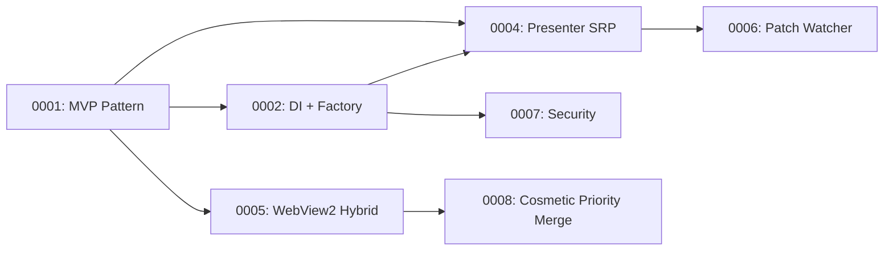

# Architecture Decision Records

This directory contains Architecture Decision Records (ADRs) for ArdysaModsTools.

An ADR is a document that captures an important architecture decision made along with its context and consequences. ADRs focus on **why** a decision was made, not just what was implemented.

## Format

All ADRs follow the [MADR](https://adr.github.io/madr/) (Markdown Any Decision Records) format. See [TEMPLATE.md](./TEMPLATE.md) for the standard template.

## Index

| ID                                                      | Title                                      | Status      | Date       |
| ------------------------------------------------------- | ------------------------------------------ | ----------- | ---------- |
| [0001](./0001-refactor-mainform-mvp.md)                 | Refactor MainForm to MVP Pattern           | ✅ Accepted | 2026-01-28 |
| [0002](./0002-complete-di-migration-factory-pattern.md) | Complete DI Migration with Factory Pattern | ✅ Accepted | 2026-02-04 |
| [0003](./0003-multi-cdn-strategy-r2-primary.md)         | Multi-CDN Strategy with R2 Primary         | ✅ Accepted | 2026-02-04 |
| [0004](./0004-presenter-decomposition-srp.md)           | Presenter Decomposition for SRP            | ✅ Accepted | 2026-02-09 |
| [0005](./0005-webview2-hybrid-ui.md)                    | WebView2 Hybrid UI Architecture            | ✅ Accepted | 2026-02-10 |
| [0006](./0006-automated-patch-watcher.md)               | Automated Patch Watcher System             | ✅ Accepted | 2026-02-10 |
| [0007](./0007-security-anti-tamper-architecture.md)     | Security & Anti-Tamper Architecture        | ✅ Accepted | 2026-02-10 |
| [0008](./0008-hero-cosmetic-priority-merge.md)          | Hero Cosmetic Base-Priority & Layered Merge | ✅ Accepted | 2026-06-13 |

## Relationships

