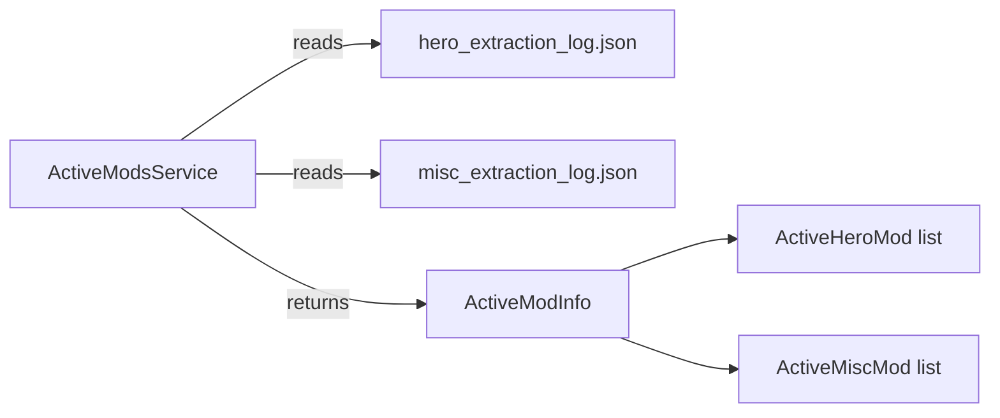

# Active Mods API

Query currently installed and active mods programmatically.

---

## Overview

The `ActiveModsService` provides a **unified read-only view** over installed mods by aggregating data from `hero_extraction_log.json` and `misc_extraction_log.json`. It introduces no new state — just a query layer.



---

## Quick Start

```csharp
// Resolve from DI
var activeMods = serviceProvider.GetRequiredService<IActiveModsService>();

// Get ALL active mods
ActiveModInfo info = await activeMods.GetActiveModsAsync(dotaPath);

Console.WriteLine($"Total mods: {info.TotalModCount}");
Console.WriteLine($"Status: {info.OverallStatus}");
Console.WriteLine($"Has mods: {info.HasActiveMods}");

// List hero sets
foreach (var hero in info.HeroMods)
    Console.WriteLine($"  Hero: {hero.HeroId} -> {hero.SetName}");

// List misc mods
foreach (var misc in info.MiscMods)
    Console.WriteLine($"  {misc.Category}: {misc.SelectedChoice}");
```

---

## Interface: IActiveModsService

**File:** `Core/Interfaces/IActiveModsService.cs`

| Method                                          | Description                         | Returns                        |
| :---------------------------------------------- | :---------------------------------- | :----------------------------- |
| `GetActiveModsAsync(dotaPath, ct)`              | Full snapshot of all active mods    | `ActiveModInfo`                |
| `GetActiveHeroModsAsync(dotaPath, ct)`          | Only hero cosmetic sets             | `IReadOnlyList<ActiveHeroMod>` |
| `GetActiveMiscModsAsync(dotaPath, ct)`          | Only misc mods (weather, HUD, etc.) | `IReadOnlyList<ActiveMiscMod>` |
| `GetActiveHeroModAsync(dotaPath, heroId, ct)`   | Single hero lookup                  | `ActiveHeroMod?`               |
| `GetActiveMiscModAsync(dotaPath, category, ct)` | Single category lookup              | `ActiveMiscMod?`               |

---

## Models

### ActiveModInfo

```csharp
public record ActiveModInfo
{
    public ModStatus OverallStatus { get; init; }
    public IReadOnlyList<ActiveHeroMod> HeroMods { get; init; }
    public IReadOnlyList<ActiveMiscMod> MiscMods { get; init; }
    public int TotalModCount { get; }         // HeroMods.Count + MiscMods.Count
    public bool HasActiveMods { get; }        // TotalModCount > 0
    public DateTime? LastGeneratedAt { get; init; }

    // Get distinct categories: ["Hero", "Weather", "HUD", ...]
    public IReadOnlyList<string> GetActiveCategories();
}
```

### ActiveHeroMod

```csharp
public record ActiveHeroMod
{
    public string HeroId { get; init; }                          // "npc_dota_hero_antimage"
    public string SetName { get; init; }                         // "Mage Slayer"
    public IReadOnlyList<string> InstalledFiles { get; init; }   // Relative file paths
}
```

### ActiveMiscMod

```csharp
public record ActiveMiscMod
{
    public string Category { get; init; }                        // "Weather", "HUD", "Terrain"
    public string SelectedChoice { get; init; }                  // "Rain", "Immortal Gardens"
    public IReadOnlyList<string> InstalledFiles { get; init; }   // Relative file paths
}
```

---

## Usage Examples

### Check if a specific hero has a custom set

```csharp
var activeMods = serviceProvider.GetRequiredService<IActiveModsService>();

var antiMageMod = await activeMods.GetActiveHeroModAsync(dotaPath, "npc_dota_hero_antimage");
if (antiMageMod != null)
{
    Console.WriteLine($"Anti-Mage has '{antiMageMod.SetName}' installed");
    Console.WriteLine($"Files: {antiMageMod.InstalledFiles.Count}");
}
else
{
    Console.WriteLine("Anti-Mage is using default cosmetics");
}
```

### Check if weather effects are active

```csharp
var weatherMod = await activeMods.GetActiveMiscModAsync(dotaPath, "Weather");
if (weatherMod != null)
    Console.WriteLine($"Weather: {weatherMod.SelectedChoice}");
else
    Console.WriteLine("No custom weather active");
```

### List all active categories

```csharp
var info = await activeMods.GetActiveModsAsync(dotaPath);
var categories = info.GetActiveCategories();
// Result: ["Hero", "Weather", "HUD"]

foreach (var cat in categories)
    Console.WriteLine($"Active category: {cat}");
```

### Handle status states

```csharp
var info = await activeMods.GetActiveModsAsync(dotaPath);

switch (info.OverallStatus)
{
    case ModStatus.Ready:
        Console.WriteLine($"{info.TotalModCount} mod(s) active since {info.LastGeneratedAt}");
        break;
    case ModStatus.NotInstalled:
        Console.WriteLine("No mods installed");
        break;
    case ModStatus.NotChecked:
        Console.WriteLine("Path not configured");
        break;
    case ModStatus.Error:
        Console.WriteLine("Error reading mod state");
        break;
}
```

---

## DI Registration

Registered automatically via `AddCoreServices()`:

```csharp
services.AddTransient<IActiveModsService, ActiveModsService>();
```

---

## Data Sources

| Source    | File Location                                     | Content                          |
| :-------- | :------------------------------------------------ | :------------------------------- |
| Hero sets | `game/_ArdysaMods/_temp/hero_extraction_log.json` | Installed hero cosmetic sets     |
| Misc mods | `game/_ArdysaMods/_temp/misc_extraction_log.json` | Weather, HUD, terrain selections |

The service reads these files on every call — no caching, always fresh data.
