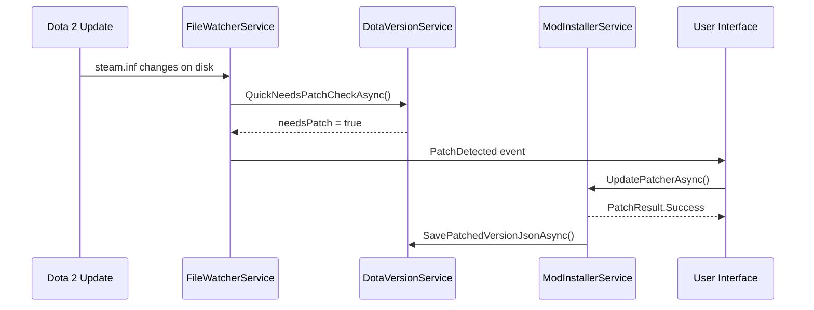

# Auto-Patching API

How to configure and use ArdysaModsTools' automatic re-patching after Dota 2 game updates.

---

## How Auto-Patching Works

When Dota 2 updates, file signatures change and the modded gameinfo may be overwritten. ArdysaModsTools detects this and re-applies patches automatically.



---

## Key Services

### DotaVersionService

**File:** `Core/Services/Mods/DotaVersionService.cs`

Tracks Dota 2 version and detects changes by comparing `steam.inf` with saved state.

| Method                                      | Description                                     | Returns                                          |
| :------------------------------------------ | :---------------------------------------------- | :----------------------------------------------- |
| `GetVersionInfoAsync(dotaPath, ct)`         | Full version info (build, patch, Steam version) | `DotaVersionInfo`                                |
| `QuickNeedsPatchCheckAsync(dotaPath, ct)`   | Fast check if re-patching needed                | `bool`                                           |
| `SaveVersionCacheAsync(dotaPath, ct)`       | Save current version to cache after patching    | `void`                                           |
| `SavePatchedVersionJsonAsync(dotaPath, ct)` | Save steam.inf metadata to `version.json`       | `void`                                           |
| `ComparePatchedVersionAsync(dotaPath, ct)`  | Compare current vs saved version                | `(bool matches, string current, string patched)` |
| `GetChangeSummary(dotaPath)`                | Human-readable summary of what changed          | `string`                                         |

#### Usage: Check if re-patch is needed

```csharp
var versionService = serviceProvider.GetRequiredService<DotaVersionService>();

// Quick check (optimized — minimal I/O)
bool needsPatch = await versionService.QuickNeedsPatchCheckAsync(dotaPath);
if (needsPatch)
{
    Console.WriteLine("Dota 2 was updated — re-patch required");

    // Get detailed change info
    var versionInfo = await versionService.GetVersionInfoAsync(dotaPath);
    Console.WriteLine($"Current build: {versionInfo.PatchVersion}");
    Console.WriteLine($"Change summary: {versionService.GetChangeSummary(dotaPath)}");
}
```

#### Usage: Save version after successful patch

```csharp
// After patching succeeds, record the current version
await versionService.SavePatchedVersionJsonAsync(dotaPath);
await versionService.SaveVersionCacheAsync(dotaPath);
```

---

### FileWatcherService

**File:** `Core/Services/Mods/FileWatcherService.cs`

Monitors Dota 2 installation for file changes using `FileSystemWatcher`. Debounces rapid changes and fires events when meaningful updates occur.

#### Configuration Parameters

| Parameter   | Default                                      | Description                            |
| :---------- | :------------------------------------------- | :------------------------------------- |
| Watch paths | `game/dota/steam.inf`, `game/csgo/steam.inf` | Files monitored for Dota updates       |
| Debounce    | 2000ms                                       | Minimum interval between change events |
| Filters     | `steam.inf`, `gameinfo.gi`                   | File name filters for the watcher      |

---

### ModInstallerService — Patching

**File:** `Core/Services/Mods/ModInstallerService.cs`

The `UpdatePatcherAsync` method handles the actual re-patching:

```csharp
var installer = serviceProvider.GetRequiredService<IModInstallerService>();

// Re-apply patches after Dota update
var result = await installer.UpdatePatcherAsync(
    dotaPath,
    statusCallback: msg => Console.WriteLine($"[Patch] {msg}"),
    ct);

if (result.Success)
    Console.WriteLine("Patches re-applied successfully");
else
    Console.WriteLine($"Patch failed: {result.Message}");
```

#### What UpdatePatcherAsync does:

1. **Pre-validates** — checks if patch is actually needed
2. **Patches signatures** — updates binary signatures in VPK
3. **Patches gameinfo** — ensures `_ArdysaMods` mount point exists
4. **Saves version** — records the patched Dota version for future comparison
5. **Rollback** — atomic operations with rollback on failure

---

## Status Service Integration

Use `StatusService` to check the overall patch state:

```csharp
var statusService = serviceProvider.GetRequiredService<IStatusService>();
var status = await statusService.GetDetailedStatusAsync(dotaPath);

switch (status.Status)
{
    case ModStatus.Ready:
        Console.WriteLine("Mods are active and up-to-date");
        break;

    case ModStatus.NeedUpdate:
        Console.WriteLine("Dota was updated — run UpdatePatcherAsync()");
        Console.WriteLine($"Action: {status.Action}");        // RecommendedAction.Update
        Console.WriteLine($"Button: {status.ActionButtonText}"); // "Patch Update"
        break;

    case ModStatus.Disabled:
        Console.WriteLine("Mods installed but gameinfo not patched");
        break;
}
```

### Auto-Refresh

```csharp
// Start monitoring for status changes (timer + file watcher)
statusService.OnStatusChanged += newStatus =>
{
    if (newStatus.Status == ModStatus.NeedUpdate)
        Console.WriteLine("Auto-detected: Dota updated! Re-patch needed.");
};
statusService.StartAutoRefresh(dotaPath);

// Later: stop monitoring
statusService.StopAutoRefresh();
```

---

## Full Auto-Patch Flow Example

```csharp
// Complete programmatic auto-patch implementation
var statusService = serviceProvider.GetRequiredService<IStatusService>();
var installer = serviceProvider.GetRequiredService<IModInstallerService>();

// Monitor for Dota updates
statusService.OnStatusChanged += async newStatus =>
{
    if (newStatus.Status == ModStatus.NeedUpdate)
    {
        Console.WriteLine("Dota 2 updated detected — auto-patching...");

        var result = await installer.UpdatePatcherAsync(
            dotaPath,
            msg => Console.WriteLine($"  {msg}"),
            CancellationToken.None);

        Console.WriteLine(result.Success
            ? "Auto-patch complete!"
            : $"Auto-patch failed: {result.Message}");

        // Force refresh status after patching
        await statusService.ForceRefreshAsync(dotaPath);
    }
};

// Start monitoring
statusService.StartAutoRefresh(dotaPath);
```

---

## Version Detection Details

### DotaVersionInfo

```csharp
public class DotaVersionInfo
{
    public string? ClientVersion { get; set; }     // e.g., "7.37d"
    public string? PatchVersion { get; set; }      // Build number from steam.inf
    public string? SteamInfHash { get; set; }      // Hash for change detection
    public bool NeedsPatch { get; set; }           // Quick flag
    public string? VersionCachePath { get; set; }  // Path to version.json
}
```

### Where version data comes from

| Data           | File                                  | Key                  |
| :------------- | :------------------------------------ | :------------------- |
| Dota build     | `game/dota/steam.inf`                 | `PatchVersion`       |
| Client version | `game/dota/steam.inf`                 | `ClientVersion`      |
| Last patched   | `game/_ArdysaMods/_temp/version.json` | Saved after patching |
