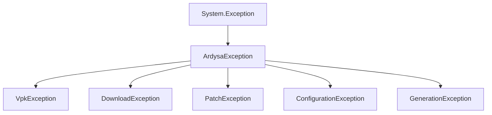

# Exceptions & Error Handling

Reference for exception hierarchy, error codes, and handling strategies.

---

## Exception Hierarchy



---

## Base Exception

### ArdysaException

**File:** `Core/Exceptions/ArdysaException.cs`

Base exception for all application errors with error codes.

```csharp
public class ArdysaException : Exception
{
    public string ErrorCode { get; }  // e.g., "VPK_001"

    public ArdysaException(string errorCode, string message);
    public ArdysaException(string errorCode, string message, Exception innerException);
}
```

Message format: `[ERROR_CODE] Human readable message`

---

## Specialized Exceptions

### VpkException

VPK operations: extraction, recompilation, replacement.

| Code      | Description          | Solution                                      |
| --------- | -------------------- | --------------------------------------------- |
| `VPK_001` | Extraction failed    | Check HLExtract.exe exists, VPK not corrupted |
| `VPK_002` | Recompilation failed | Check vpk.exe exists, disk space available    |
| `VPK_003` | Replacement failed   | Close Dota 2, check file permissions          |
| `VPK_004` | Validation failed    | VPK missing `_ArdysaMods` marker              |
| `VPK_005` | File not found       | Verify Dota 2 installation path               |

---

### DownloadException

Network operations: downloads, timeouts.

```csharp
public class DownloadException : ArdysaException
{
    public string? FailedUrl { get; }
}
```

| Code     | Description          | Solution                    |
| -------- | -------------------- | --------------------------- |
| `DL_001` | Network unreachable  | Check internet connection   |
| `DL_002` | Timeout              | Retry, check firewall/proxy |
| `DL_003` | Invalid URL          | Report bug                  |
| `DL_004` | File not found (404) | CDN may be updating         |
| `DL_005` | Server error (5xx)   | CDN issue, retry later      |
| `DL_006` | Hash mismatch        | Re-download, file corrupted |

---

### PatchException

Patching operations: items_game.txt, signatures, gameinfo.

```csharp
public class PatchException : ArdysaException
{
    public string? TargetFile { get; }
}
```

| Code        | Description     | Solution                 |
| ----------- | --------------- | ------------------------ |
| `PATCH_001` | Block not found | Game may have updated    |
| `PATCH_002` | Invalid format  | Corrupted file           |
| `PATCH_003` | Write failed    | Check file permissions   |
| `PATCH_004` | Backup failed   | Disk full or permissions |
| `PATCH_005` | Restore failed  | Manual restore needed    |

---

### ConfigurationException

Configuration and detection issues.

| Code      | Description           | Solution                      |
| --------- | --------------------- | ----------------------------- |
| `CFG_001` | Dota 2 not found      | Use Manual Detect             |
| `CFG_002` | Invalid path          | Path doesn't contain Dota 2   |
| `CFG_003` | Config parse error    | Delete config, restart app    |
| `CFG_004` | Missing required file | Reinstall app                 |
| `CFG_005` | Permission denied     | Run as admin or change folder |

---

### GenerationException

Hero/misc generation failures.

```csharp
public class GenerationException : ArdysaException
{
    public string? HeroName { get; }
    public string? SetName { get; }
}
```

| Code      | Description      | Solution                  |
| --------- | ---------------- | ------------------------- |
| `GEN_001` | Download failed  | Check internet, retry     |
| `GEN_002` | Extract failed   | Check disk space          |
| `GEN_003` | Merge failed     | Set assets corrupted      |
| `GEN_004` | Patch failed     | Game version incompatible |
| `GEN_005` | Recompile failed | VPK tools issue           |
| `GEN_006` | Replace failed   | Close Dota 2              |
| `GEN_007` | Invalid set data | Report bug                |

---

## Error Codes Quick Reference

**File:** `Core/Exceptions/ErrorCodes.cs`

```csharp
public static class ErrorCodes
{
    // VPK
    public const string VPK_EXTRACTION_FAILED = "VPK_001";
    public const string VPK_RECOMPILE_FAILED = "VPK_002";
    public const string VPK_REPLACE_FAILED = "VPK_003";

    // Downloads
    public const string DL_NETWORK_ERROR = "DL_001";
    public const string DL_TIMEOUT = "DL_002";

    // Patching
    public const string PATCH_BLOCK_NOT_FOUND = "PATCH_001";

    // Config
    public const string CFG_DOTA_NOT_FOUND = "CFG_001";

    // Generation
    public const string GEN_DOWNLOAD_FAILED = "GEN_001";
}
```

---

## OperationResult Pattern

For expected failures (not exceptional), use `OperationResult`:

```csharp
// Service returns result
public async Task<OperationResult> InstallAsync(CancellationToken ct)
{
    try
    {
        ct.ThrowIfCancellationRequested();
        await DoWork();
        return OperationResult.Ok("Installed successfully");
    }
    catch (OperationCanceledException)
    {
        return OperationResult.Fail("Canceled by user.");
    }
    catch (IOException ex)
    {
        return OperationResult.Fail($"IO error: {ex.Message}");
    }
}

// Caller checks result
var result = await service.InstallAsync(ct);
if (!result.Success)
{
    logger.Log($"Failed: {result.Message}");
    ShowError(result.Message);
    return;
}
```

### When to Use What

| Situation                              | Use                                  |
| -------------------------------------- | ------------------------------------ |
| Expected failure (network, user input) | `OperationResult.Fail()`             |
| Programmer error, invariant violation  | Throw exception                      |
| Unrecoverable state                    | Throw `ArdysaException`              |
| Batch operation partial failure        | `OperationResult` with `FailedItems` |

---

## Exception Handling Strategy

### Service Layer

```csharp
public async Task<OperationResult> InstallAsync(CancellationToken ct)
{
    try
    {
        ct.ThrowIfCancellationRequested();
        // ... operation
        return OperationResult.Ok();
    }
    catch (OperationCanceledException)
    {
        return OperationResult.Fail("Canceled by user.");
    }
    catch (ArdysaException ex)
    {
        _logger.Log($"[{ex.ErrorCode}] {ex.Message}");
        return OperationResult.Fail(ex);
    }
    catch (Exception ex)
    {
        _logger.Log($"Unexpected error: {ex}");
        return OperationResult.Fail(ex);
    }
}
```

### UI Layer

```csharp
private async void InstallButton_Click(object sender, EventArgs e)
{
    try
    {
        DisableButtons();
        var result = await _service.InstallAsync(_cts.Token);

        if (result.Success)
            ShowSuccess(result.Message);
        else
            ShowError("Installation Failed", result.Message);
    }
    catch (Exception ex)
    {
        FallbackLogger.Log($"UI exception: {ex}");
        ShowError("Error", ex.Message);
    }
    finally
    {
        EnableButtons();
    }
}
```

### Global Handlers

Set up in `Program.cs`:

```csharp
Application.ThreadException += (s, e) =>
{
    MessageBox.Show($"Error: {e.Exception.Message}");
    FallbackLogger.Log($"ThreadException: {e.Exception}");
};

AppDomain.CurrentDomain.UnhandledException += (s, e) =>
{
    var ex = e.ExceptionObject as Exception;
    FallbackLogger.Log($"UnhandledException: {ex}");
};
```

---

## Logging Errors

Always include context:

```csharp
catch (VpkException ex)
{
    _logger.Log($"VPK Error [{ex.ErrorCode}]: {ex.Message}");
    _logger.Log($"Stack trace: {ex.StackTrace}");
    if (ex.InnerException != null)
        _logger.Log($"Inner: {ex.InnerException}");
}
```

---

## Troubleshooting Guide

### Common Issues

| Symptom                     | Likely Cause          | Solution              |
| --------------------------- | --------------------- | --------------------- |
| "VPK_001 Extraction failed" | HLExtract.exe missing | Reinstall application |
| "DL_002 Timeout"            | Slow connection       | Retry, check firewall |
| "PATCH_001 Block not found" | Game updated          | Wait for AMT update   |
| "CFG_001 Dota 2 not found"  | Non-standard install  | Use Manual Detect     |
| "GEN_006 Replace failed"    | Dota 2 running        | Close game first      |

### Debug Steps

1. Check `%APPDATA%/ArdysaModsTools/logs/` for detailed logs
2. Verify Dota 2 path is correct
3. Ensure Dota 2 is not running
4. Check antivirus isn't blocking tools
5. Try running as administrator
