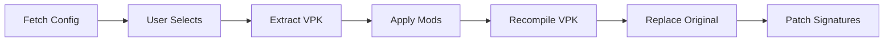

# Misc Mods API

Programmatic control for HUD skins, weather effects, terrain, and other miscellaneous mods.

---

## Overview

Misc mods are non-hero cosmetic modifications: weather effects, terrain skins, HUD themes, battle effects, and more. They are managed through a generation pipeline that extracts the VPK, applies modifications, and recompiles.



---

## Fetching Available Options

Use `RemoteMiscConfigService` to get the list of available misc mods:

```csharp
var configService = serviceProvider.GetRequiredService<RemoteMiscConfigService>();
var config = await configService.FetchConfigAsync(ct);

foreach (var option in config.Options)
{
    Console.WriteLine($"[{option.Category}] {option.DisplayName}");
    Console.WriteLine($"  Choices: {string.Join(", ", option.Choices)}");

    // Get thumbnail for a specific choice
    var thumbUrl = option.GetThumbnailUrl("Rain");
    Console.WriteLine($"  Thumbnail: {thumbUrl}");
}
```

### Available Categories

| Category    | Examples                        | Description               |
| :---------- | :------------------------------ | :------------------------ |
| Weather     | Rain, Snow, Harvest, Pestilence | Weather particle effects  |
| HUD         | Immortal Gardens, Dire Shards   | HUD skin overlays         |
| Terrain     | Reef Edge, Immortal Gardens     | Map terrain replacements  |
| Shader      | Custom color grading            | Post-processing effects   |
| Emblems     | Custom team emblems             | Team logo replacements    |
| AtkModifier | Custom attack effects           | Hero attack particle mods |

---

## Generating Misc Mods

### Enable a custom weather effect

```csharp
var miscGen = serviceProvider.GetRequiredService<MiscGenerationService>();

// Select weather: "Rain"
var selections = new Dictionary<string, string>
{
    ["Weather"] = "Rain"
};

var result = await miscGen.PerformGenerationAsync(
    dotaPath,
    selections,
    log: msg => Console.WriteLine($"[Misc] {msg}"),
    ct);

if (result.Success)
    Console.WriteLine("Weather effect applied!");
else
    Console.WriteLine($"Failed: {result.Message}");
```

### Enable a custom HUD theme

```csharp
var selections = new Dictionary<string, string>
{
    ["HUD"] = "Immortal Gardens"
};

await miscGen.PerformGenerationAsync(dotaPath, selections,
    msg => Console.WriteLine(msg), ct);
```

### Disable a weather effect (reset to default)

```csharp
// Set the selection to "Default" to remove the mod
var selections = new Dictionary<string, string>
{
    ["Weather"] = "Default"
};

await miscGen.PerformGenerationAsync(dotaPath, selections,
    msg => Console.WriteLine(msg), ct);
```

### Apply multiple misc mods at once

```csharp
var selections = new Dictionary<string, string>
{
    ["Weather"] = "Snow",
    ["HUD"] = "Dire Shards",
    ["Terrain"] = "Reef Edge",
    ["Shader"] = "Vibrant"
};

var result = await miscGen.PerformGenerationAsync(dotaPath, selections,
    msg => Console.WriteLine(msg), ct);

Console.WriteLine($"Applied {selections.Count} misc mod(s)");
```

---

## Generation Modes

| Mode            | Description                              | Use Case                             |
| :-------------- | :--------------------------------------- | :----------------------------------- |
| `AddToCurrent`  | Merges new selections with existing mods | Adding one more mod to current setup |
| `CleanGenerate` | Fresh extraction, replaces all mods      | Starting over or avoiding conflicts  |

---

## Checking Active Misc Mods

Use `ActiveModsService` to query what's currently installed:

```csharp
var activeMods = serviceProvider.GetRequiredService<IActiveModsService>();

// Check if weather is active
var weather = await activeMods.GetActiveMiscModAsync(dotaPath, "Weather");
if (weather != null)
{
    Console.WriteLine($"Active weather: {weather.SelectedChoice}");
    Console.WriteLine($"Installed files: {weather.InstalledFiles.Count}");
}

// Check if HUD is active
var hud = await activeMods.GetActiveMiscModAsync(dotaPath, "HUD");
if (hud != null)
    Console.WriteLine($"Active HUD: {hud.SelectedChoice}");

// Get ALL misc mods at once
var miscMods = await activeMods.GetActiveMiscModsAsync(dotaPath);
foreach (var mod in miscMods)
    Console.WriteLine($"  {mod.Category} -> {mod.SelectedChoice}");
```

---

## MiscOption Model

Each misc mod option from the remote config:

```csharp
public class MiscOption
{
    public string Id { get; set; }           // Internal ID (e.g., "Weather")
    public string DisplayName { get; set; }  // UI label (e.g., "Weather Effects")
    public string Category { get; set; }     // Grouping category
    public List<string> Choices { get; set; }          // Available choices
    public string? SelectedChoice { get; set; }        // Current selection
    public string? ThumbnailUrlPattern { get; set; }   // URL pattern with {choice}

    // Get thumbnail URL for a specific choice
    public string? GetThumbnailUrl(string choice);
}
```

### Thumbnail Pattern

```csharp
// Pattern uses {choice} as placeholder
var option = new MiscOption
{
    ThumbnailUrlPattern = "https://cdn.ardysamods.my.id/misc/weather/{choice}.png"
};

string url = option.GetThumbnailUrl("Rain");
// -> "https://cdn.ardysamods.my.id/misc/weather/rain.png"
```

---

## Conflict Detection

When generating misc mods, conflicts may arise (e.g., two mods modifying the same file). The conflict system handles this automatically:

```csharp
// Conflicts are recorded in the extraction log
var miscLog = MiscExtractionLog.Load(dotaPath);
if (miscLog?.ConflictsDetected.Count > 0)
{
    Console.WriteLine("Conflicts detected during generation:");
    foreach (var conflict in miscLog.ConflictsDetected)
        Console.WriteLine($"  - {conflict}");

    Console.WriteLine("Resolutions applied:");
    foreach (var (id, resolution) in miscLog.ResolutionsApplied)
        Console.WriteLine($"  {id}: {resolution}");
}
```

---

## Pipeline Services

| Service                   | Responsibility                            |
| :------------------------ | :---------------------------------------- |
| `RemoteMiscConfigService` | Fetches available options from CDN        |
| `MiscGenerationService`   | Orchestrates the full generation pipeline |
| `AssetModifierService`    | Applies individual asset modifications    |
| `VpkExtractorService`     | Extracts VPK for modification             |
| `VpkRecompilerService`    | Recompiles modified files into VPK        |
| `VpkReplacerService`      | Safely replaces original VPK              |
