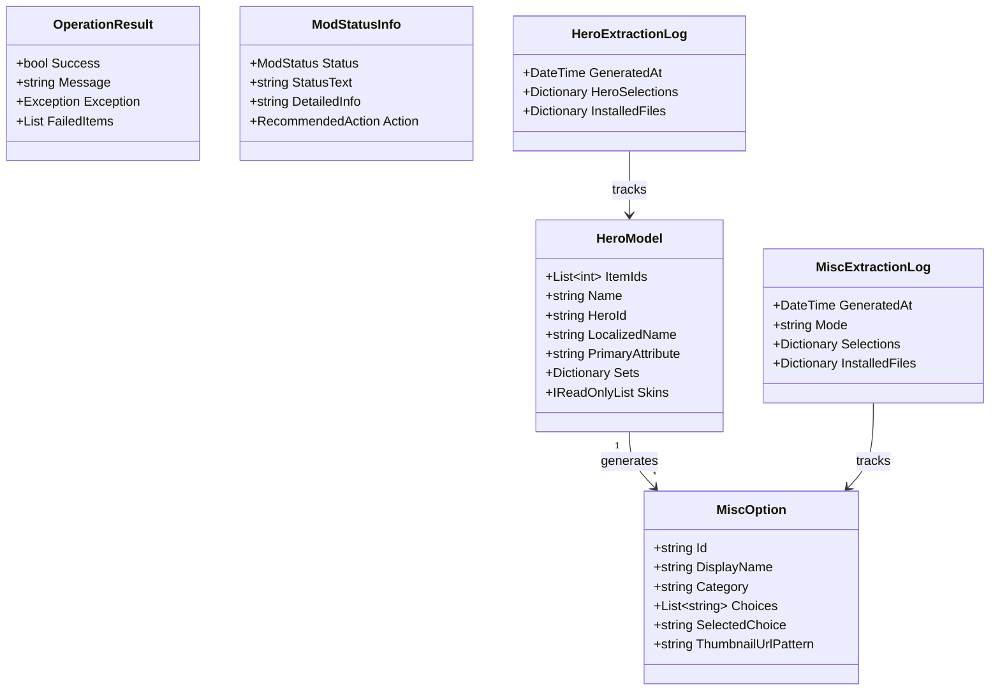
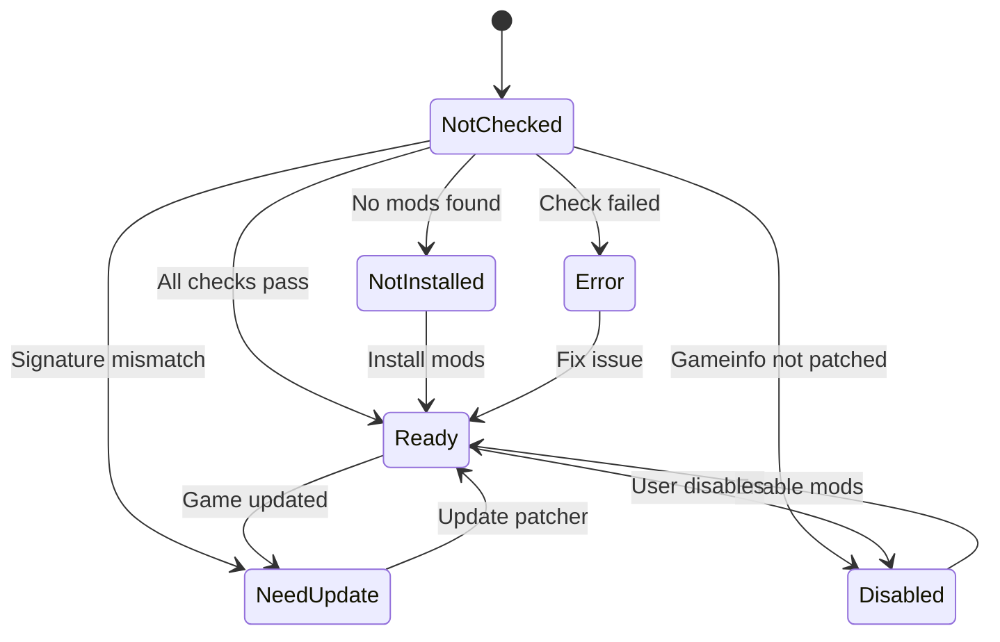
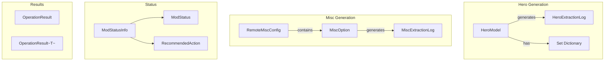

# Models Reference

Complete reference for data models and DTOs in `Core/Models/`.

---

## Model Overview



---

## Core Models

### HeroModel

**File:** `Core/Models/HeroModel.cs`

Represents a Dota 2 hero with customizable cosmetic sets.

```csharp
public sealed class HeroModel
{
    // Numeric item IDs for items_game.txt blocks
    [JsonPropertyName("id")]
    public List<int> ItemIds { get; set; }

    // Hero name (short/friendly)
    [JsonPropertyName("name")]
    public string Name { get; set; }

    // Internal NPC ID (e.g., "npc_dota_hero_abaddon")
    [JsonPropertyName("used_by_heroes")]
    public string HeroId { get; set; }

    // Localized display name
    [JsonPropertyName("localized_name")]
    public string LocalizedName { get; set; }

    // Computed display name (prefers LocalizedName > Name > HeroId)
    [JsonIgnore]
    public string DisplayName { get; }

    // Primary attribute: strength, agility, intelligence, universal
    [JsonPropertyName("primary_attr")]
    public string PrimaryAttribute { get; set; }

    // Sets map: setName -> list of asset URLs
    [JsonPropertyName("sets")]
    public Dictionary<string, List<string>> Sets { get; set; }

    // Read-only list of set names
    [JsonIgnore]
    public IReadOnlyList<string> Skins { get; }
}
```

#### JSON Example

```json
{
   "id": [555, 556, 557],
   "name": "antimage",
   "used_by_heroes": "npc_dota_hero_antimage",
   "localized_name": "Anti-Mage",
   "primary_attr": "agility",
   "sets": {
      "Default": [],
      "Mage Slayer": ["https://cdn.example.com/sets/am_mageslayer.zip"]
   }
}
```

---

### MiscOption

**File:** `Core/Models/MiscOption.cs`

Represents a miscellaneous mod option (weather, terrain, etc.).

```csharp
public class MiscOption
{
    public string Id { get; set; }           // Internal ID
    public string DisplayName { get; set; }  // UI display name
    public string Category { get; set; }     // Grouping category
    public List<string> Choices { get; set; }
    public string? SelectedChoice { get; set; }
    public string? ThumbnailUrlPattern { get; set; }

    // Get thumbnail URL for a choice
    public string? GetThumbnailUrl(string choice);
}
```

#### Thumbnail Pattern

The `ThumbnailUrlPattern` uses `{choice}` as placeholder:

```csharp
var option = new MiscOption
{
    Id = "Weather",
    ThumbnailUrlPattern = "https://cdn.example.com/misc/weather/{choice}.png",
    Choices = new List<string> { "Rain", "Snow", "Harvest" }
};

string url = option.GetThumbnailUrl("Rain");
// Returns: "https://cdn.example.com/misc/weather/rain.png"
```

---

## Result Types

### OperationResult

**File:** `Core/Models/OperationResult.cs`

Standard result type for service operations (non-generic).

```csharp
public class OperationResult
{
    public bool Success { get; init; }
    public string? Message { get; init; }
    public Exception? Exception { get; init; }
    public List<(string name, string reason)>? FailedItems { get; init; }
    public int SuccessCount { get; init; }

    // Factory methods
    public static OperationResult Ok(string? message = null);
    public static OperationResult Ok(int successCount, string? message = null);
    public static OperationResult Fail(string message);
    public static OperationResult Fail(Exception ex);
    public static OperationResult Fail(string message, List<(string, string)> failedItems);
}
```

### OperationResult&lt;T&gt;

Generic version with typed data.

```csharp
public class OperationResult<T>
{
    public bool Success { get; init; }
    public T? Data { get; init; }
    public string? ErrorMessage { get; init; }
    public Exception? Exception { get; init; }

    // Implicit bool conversion
    public static implicit operator bool(OperationResult<T> result);

    // Factory methods
    public static OperationResult<T> Ok(T data);
    public static OperationResult<T> Fail(string error);
    public static OperationResult<T> Fail(Exception ex);
}
```

#### Usage Pattern

```csharp
// Service method returns result
var result = await service.LoadHeroesAsync();

// Check and use
if (!result.Success)
{
    logger.Log($"Error: {result.ErrorMessage}");
    return;
}
var heroes = result.Data;

// Or use implicit bool
if (result)
{
    ProcessHeroes(result.Data);
}
```

---

## Status Types

### ModStatus Enum

```csharp
public enum ModStatus
{
    NotChecked,    // Initial state
    Ready,         // Mods installed and working
    NeedUpdate,    // Signatures need patching
    NotInstalled,  // No mods installed
    Disabled,      // Mods disabled
    Error          // Error condition
}
```

### RecommendedAction Enum

```csharp
public enum RecommendedAction
{
    None,     // No action needed
    Install,  // Install mods
    Update,   // Update patcher
    Enable,   // Re-enable mods
    Fix       // Fix error condition
}
```

### ModStatusInfo Record

```csharp
public record ModStatusInfo
{
    public ModStatus Status { get; init; }
    public string StatusText { get; init; }
    public string DetailedInfo { get; init; }
    public RecommendedAction Action { get; init; }
    public string? Version { get; init; }
    public DateTime? LastModified { get; init; }
    public bool HasModsPack { get; init; }
    public bool IsGameInfoPatched { get; init; }
    public bool IsSignaturesPatched { get; init; }
}
```

#### Status Flow



---

## Extraction Logs

### HeroExtractionLog

**File:** `Core/Models/HeroExtractionLog.cs`

Tracks hero set generation for cleanup and restoration.

```csharp
public class HeroExtractionLog
{
    public DateTime GeneratedAt { get; set; }

    // hero name -> selected set name
    public Dictionary<string, string> HeroSelections { get; set; }

    // hero name -> list of installed file paths
    public Dictionary<string, List<string>> InstalledFiles { get; set; }

    public static HeroExtractionLog? Load(string targetPath);
    public void Save(string targetPath);
}
```

### MiscExtractionLog

**File:** `Core/Models/MiscExtractionLog.cs`

Tracks misc mod generation.

```csharp
public class MiscExtractionLog
{
    public DateTime GeneratedAt { get; set; }
    public string Mode { get; set; }  // "AddToCurrent" or "CleanGenerate"

    // option ID -> selected choice
    public Dictionary<string, string> Selections { get; set; }

    // category -> list of installed files
    public Dictionary<string, List<string>> InstalledFiles { get; set; }

    public void AddFiles(string category, IEnumerable<string> files);
    public static MiscExtractionLog? Load(string targetPath);
    public void Save(string targetPath);
}
```

---

## Configuration Models

### RemoteMiscConfig

**File:** `Core/Models/RemoteMiscConfig.cs`

Configuration fetched from remote server for misc mods.

```csharp
public class RemoteMiscConfig
{
    public List<MiscOption> Options { get; set; }
    public string Version { get; set; }
    public DateTime LastUpdated { get; set; }
}
```

### VersionInfo

**File:** `Core/Models/VersionInfo.cs`

```csharp
public class VersionInfo
{
    public string Version { get; set; }
    public string DownloadUrl { get; set; }
}
```

---

## Enums

### MiscGenerationMode

**File:** `Core/Models/MiscGenerationMode.cs`

```csharp
public enum MiscGenerationMode
{
    AddToCurrent,  // Merge with existing mods
    CleanGenerate  // Start fresh, replace all
}
```

---

## Model Relationships


