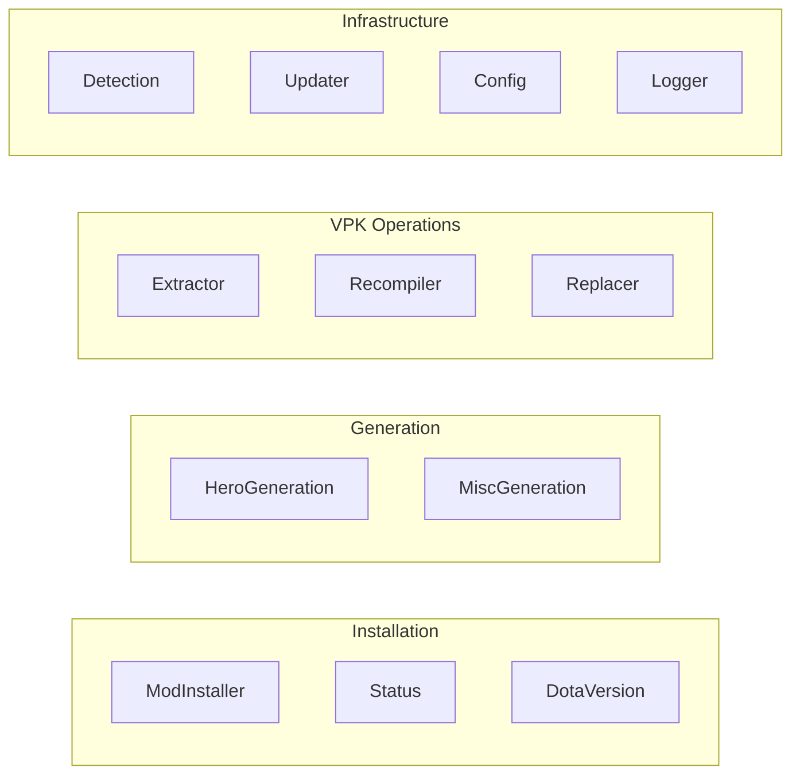
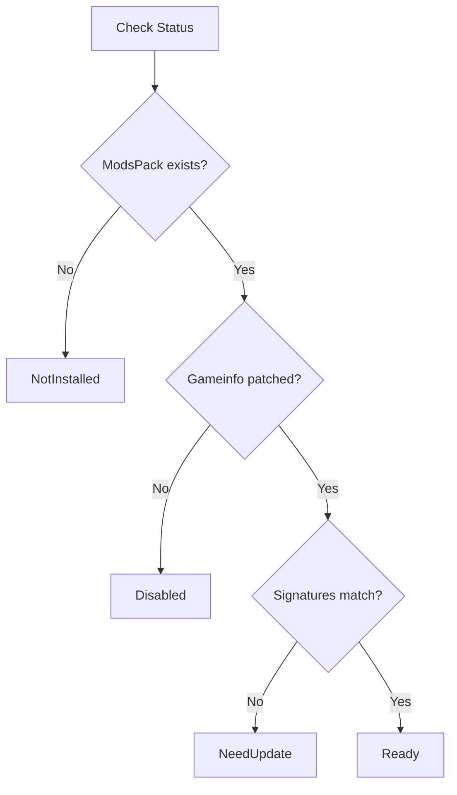
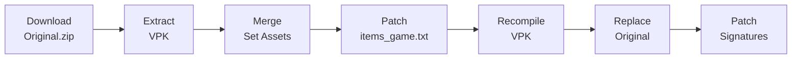

# Services Reference

Complete reference for all services in `Core/Services/`.

---

## Service Overview



---

## Mod Installation Services

### ModInstallerService

**File:** `Core/Services/Mods/ModInstallerService.cs`  
**Interface:** `IModInstallerService`

Primary service for mod installation operations.

#### Key Methods

| Method                                          | Description                                | Returns           |
| ----------------------------------------------- | ------------------------------------------ | ----------------- |
| `InstallModsAsync(dotaPath, force, ct)`         | Download and install mod pack              | `OperationResult` |
| `DisableModsAsync(dotaPath, ct)`                | Remove mods, restore original gameinfo     | `OperationResult` |
| `ManualInstallModsAsync(dotaPath, vpkPath, ct)` | Install user-provided VPK                  | `OperationResult` |
| `UpdatePatcherAsync(dotaPath, mode, cb, ct)`    | Patch signatures/gameinfo                  | `OperationResult` |
| `ValidateVpkAsync(vpkPath, ct)`                 | Validate VPK contains `_ArdysaMods` marker | `bool`            |
| `IsRequiredModFilePresent(dotaPath)`            | Check if mods installed                    | `bool`            |
| `CheckForNewerModsPackAsync(dotaPath, ct)`      | Compare local/remote hashes                | `bool`            |

#### Patch Modes

```csharp
public enum PatchMode
{
    Quick,  // Signatures only (fast, after game update)
    Full    // Signatures + gameinfo (complete patch)
}
```

#### Usage Example

```csharp
var installer = serviceProvider.GetRequiredService<ModInstallerService>();

// Install mods
var result = await installer.InstallModsAsync(dotaPath, force: false, ct);
if (!result.Success)
{
    Console.WriteLine($"Install failed: {result.Message}");
    return;
}

// After game update
await installer.UpdatePatcherAsync(dotaPath, PatchMode.Quick,
    msg => Console.WriteLine(msg), ct);
```

---

### StatusService

**File:** `Core/Services/Mods/StatusService.cs`  
**Interface:** `IStatusService`

Monitors mod installation status with caching and auto-refresh.

#### ModStatus Enum

| Status         | Description                          | UI Color |
| -------------- | ------------------------------------ | -------- |
| `NotChecked`   | Initial state                        | Gray     |
| `Ready`        | Mods installed and working           | Green    |
| `NeedUpdate`   | Signatures need patching             | Orange   |
| `NotInstalled` | No mods installed                    | Gray     |
| `Disabled`     | Mods disabled (gameinfo not patched) | Gray     |
| `Error`        | Error condition                      | Red      |

#### Key Methods

| Method                                  | Description            |
| --------------------------------------- | ---------------------- |
| `GetDetailedStatusAsync(dotaPath, ct)`  | Full status validation |
| `ForceRefreshAsync(dotaPath, ct)`       | Refresh, clear cache   |
| `StartAutoRefresh(dotaPath)`            | Timer-based refresh    |
| `StopAutoRefresh()`                     | Stop auto-refresh      |
| `UpdateStatusUI(status, label, action)` | Update UI elements     |

#### Status Checking Logic



---

## Hero Generation Services

### HeroGenerationService

**File:** `Core/Services/Hero/HeroGenerationService.cs`  
**Interface:** `IHeroGenerationService`

Orchestrates the full hero set generation pipeline.

#### Pipeline



#### Key Methods

| Method                                                  | Description                |
| ------------------------------------------------------- | -------------------------- |
| `GenerateHeroSetAsync(path, hero, setName, log, ct)`    | Single hero generation     |
| `GenerateBatchAsync(path, heroSets, log, progress, ct)` | Batch generation           |
| `FilterHeroesForProcessing(heroes)`                     | Filter heroes needing work |
| `PatchSignaturesAndGameInfoAsync(path, ct)`             | Post-generation patching   |

#### Usage Example

```csharp
var heroGen = serviceProvider.GetRequiredService<HeroGenerationService>();

var selections = new List<(HeroModel hero, string setName)>
{
    (antiMage, "Mage Slayer"),
    (invoker, "Dark Artistry")
};

var result = await heroGen.GenerateBatchAsync(
    dotaPath,
    selections,
    log => Console.WriteLine(log),
    progress => progressBar.Value = progress,
    cancellationToken);
```

---

### HeroSetPatcherService

**File:** `Core/Services/Hero/HeroSetPatcherService.cs`

Patches `items_game.txt` with hero set definitions using KeyValues block replacement.

#### Key Methods

| Method                                                    | Description               |
| --------------------------------------------------------- | ------------------------- |
| `PatchItemsGameAsync(extractDir, hero, indexContent, ct)` | Patch items_game.txt      |
| `ParseKvBlocks(indexContent)`                             | Parse index.txt KV blocks |
| `ApplyBlockReplacements(content, blocks)`                 | Apply block replacements  |

#### How It Works

1. Parse `index.txt` from hero set (contains item block overrides)
2. Extract each block by ID from `items_game.txt`
3. Replace blocks with set-specific versions
4. Write modified file

---

### HeroSetDownloaderService

**File:** `Core/Services/Hero/HeroSetDownloaderService.cs`

Downloads hero set ZIP files from CDN with retry logic and progress reporting.

---

### LocalizationPatcherService

**File:** `Core/Services/Hero/LocalizationPatcherService.cs`

Patches localization files (tooltips, ability descriptions) for custom sets.

---

## Misc Mod Services

### MiscGenerationService

**File:** `Core/Services/Misc/MiscGenerationService.cs`

Orchestrates misc mod generation (weather, terrain, HUD, etc.).

#### Generation Modes

| Mode            | Description                   |
| --------------- | ----------------------------- |
| `AddToCurrent`  | Merge with existing mods      |
| `CleanGenerate` | Fresh extraction, replace all |

#### Key Method

```csharp
Task<OperationResult> PerformGenerationAsync(
    string targetPath,
    Dictionary<string, string> selections,  // optionId -> choice
    Action<string> log,
    CancellationToken ct = default)
```

---

### AssetModifierService

**File:** `Core/Services/Misc/AssetModifierService.cs`

Applies asset modifications based on user selections. Handles:

-  Weather effects
-  Terrain/map replacements
-  HUD modifications
-  Audio replacements

---

### RemoteMiscConfigService

**File:** `Core/Services/Misc/RemoteMiscConfigService.cs`

Fetches misc mod configuration from remote server. Returns `RemoteMiscConfig` with available options.

---

## VPK Services

### VpkExtractorService

**File:** `Core/Services/Vpk/VpkExtractorService.cs`  
**Interface:** `IVpkExtractor`

Extracts VPK archives using HLExtract.exe.

```csharp
Task<bool> ExtractAsync(
    string hlExtractPath,
    string vpkPath,
    string outputDir,
    Action<string> log,
    CancellationToken ct)
```

---

### VpkRecompilerService

**File:** `Core/Services/Vpk/VpkRecompilerService.cs`  
**Interface:** `IVpkRecompiler`

Recompiles directories into VPK using vpk.exe.

```csharp
Task<string?> RecompileAsync(
    string vpkToolPath,
    string sourceDir,
    string outputDir,
    string tempRoot,
    Action<string> log,
    CancellationToken ct)
```

---

### VpkReplacerService

**File:** `Core/Services/Vpk/VpkReplacerService.cs`  
**Interface:** `IVpkReplacer`

Safely replaces original VPK with generated one (backup + atomic rename).

---

### OriginalVpkService

**File:** `Core/Services/Vpk/OriginalVpkService.cs`

Manages Original.zip downloads and caching for hero generation.

---

## Detection Services

### DetectionService

**File:** `Core/Services/Detection/DetectionService.cs`

Auto-detects Dota 2 installation path.

#### Detection Order

1. **Steam Registry** — `HKCU\Software\Valve\Steam\SteamExe`
2. **LibraryFolders.vdf** — Parse Steam library paths
3. **HKEY_CLASSES_ROOT** — `dota2\Shell\Open\Command`
4. **Uninstall Registry** — `Steam App 570` InstallLocation
5. **Default Path** — `C:\Program Files (x86)\Steam\steamapps\common\dota 2 beta`

---

## Update Services

### UpdaterService

**File:** `Core/Services/Update/UpdaterService.cs`

Handles application auto-updates with strategy pattern.

#### Update Strategies

| Strategy                  | Description                                |
| ------------------------- | ------------------------------------------ |
| `InstallerUpdateStrategy` | Download new installer, prompt user to run |
| `PortableUpdateStrategy`  | In-place update with file replacement      |

---

## Security Services

### SecurityManager

**File:** `Core/Services/Security/SecurityManager.cs`

Orchestrates security checks at startup.

```csharp
// In Program.cs
if (!SecurityManager.Initialize(exitOnFailure: true))
    return; // Security check failed
```

#### Components

| Component          | Purpose                                      |
| ------------------ | -------------------------------------------- |
| `AntiDebug`        | Detect debuggers, timing anomalies, RE tools |
| `IntegrityCheck`   | Validate assembly checksums                  |
| `SecureConfig`     | Encrypted configuration storage              |
| `StringProtection` | String obfuscation helpers                   |

---

## Logging Services

### Logger

**File:** `Core/Services/Logging/Logger.cs`

Full-featured logger with file rotation, async writing, and severity levels.

### FallbackLogger

**File:** `Core/Services/Logging/FallbackLogger.cs`

Static fallback for critical paths where DI isn't available (global exception handlers).

```csharp
// Use Logger via DI
_logger.Log("Operation started");

// Use FallbackLogger for emergencies
FallbackLogger.Log($"UnhandledException: {ex}");
```

---

## Configuration Services

| Service               | Purpose            | Storage Location           |
| --------------------- | ------------------ | -------------------------- |
| `ConfigService`       | General app config | `%APPDATA%/config.json`    |
| `UserSettingsService` | User preferences   | `%APPDATA%/settings.json`  |
| `FavoritesStore`      | Favorite heroes    | `%APPDATA%/favorites.json` |
| `MainConfigService`   | Window state       | `%APPDATA%/main.json`      |
