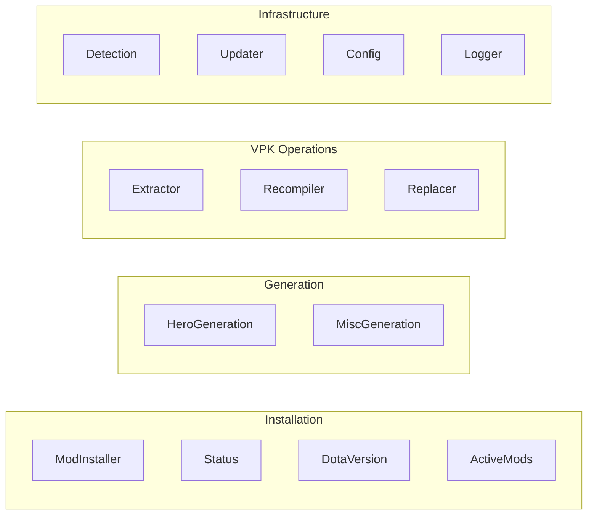
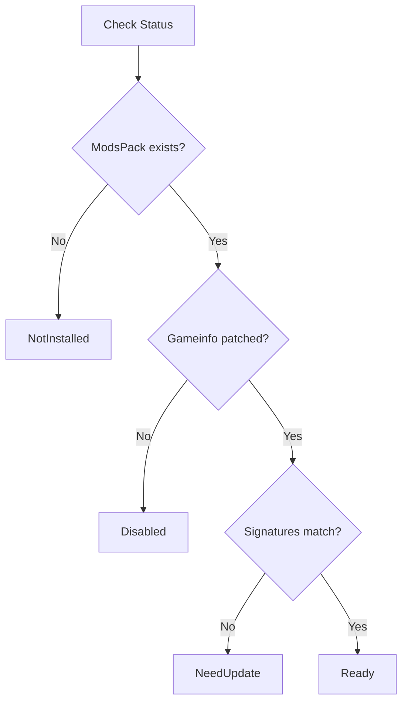
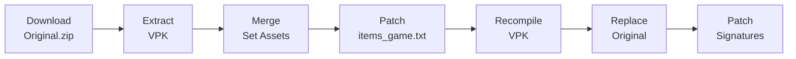

# Services Reference

Complete reference for all services in `Core/Services/`.

---

## Service Overview


```mermaid
graph LR
    subgraph "Installation"
        MIS[ModInstaller]
        SS[Status]
        DVS[DotaVersion]
        AMS[ActiveMods]
    end

    subgraph "Generation"
        HGS[HeroGeneration]
        MGS[MiscGeneration]
    end

    subgraph "VPK Operations"
        VE[Extractor]
        VR[Recompiler]
        VRep[Replacer]
    end

    subgraph "Infrastructure"
        DS[Detection]
        US[Updater]
        CS[Config]
        LS[Logger]
    end
```

---

## Mod Installation Services

### ModInstallerService

**File:** `Core/Services/Mods/ModInstallerService.cs`  
**Interface:** `IModInstallerService`

Primary service for mod installation operations.

#### Key Methods

| Method                                          | Description                                | Returns           |
| ----------------------------------------------- | ------------------------------------------ | ----------------- |
| `InstallModsAsync(dotaPath, force, ct)`         | Download and install mod pack              | `OperationResult` |
| `DisableModsAsync(dotaPath, ct)`                | Remove mods, restore original gameinfo     | `OperationResult` |
| `ManualInstallModsAsync(dotaPath, vpkPath, ct)` | Install user-provided VPK                  | `OperationResult` |
| `UpdatePatcherAsync(dotaPath, cb, ct)`          | Patch signatures/gameinfo (full patch)     | `OperationResult` |
| `ValidateVpkAsync(vpkPath, ct)`                 | Validate VPK contains `_ArdysaMods` marker | `bool`            |
| `IsRequiredModFilePresent(dotaPath)`            | Check if mods installed                    | `bool`            |
| `CheckForNewerModsPackAsync(dotaPath, ct)`      | Compare local/remote hashes                | `bool`            |

#### Usage Example

```csharp
var installer = serviceProvider.GetRequiredService<ModInstallerService>();

// Install mods
var result = await installer.InstallModsAsync(dotaPath, force: false, ct);
if (!result.Success)
{
    Console.WriteLine($"Install failed: {result.Message}");
    return;
}

// After game update - always does full patch
await installer.UpdatePatcherAsync(dotaPath,
    msg => Console.WriteLine(msg), ct);
```

---

### StatusService

**File:** `Core/Services/Mods/StatusService.cs`  
**Interface:** `IStatusService`

Checks mod installation status via step-based validation (stateless — live watching is `DotaPatchWatcherService`'s job).

#### ModStatus Enum

| Status         | Description                          | UI Color |
| -------------- | ------------------------------------ | -------- |
| `NotChecked`   | Initial state                        | Gray     |
| `Ready`        | Mods installed and working           | Green    |
| `NeedUpdate`   | Signatures need patching             | Orange   |
| `NotInstalled` | No mods installed                    | Gray     |
| `Disabled`     | Mods disabled (gameinfo not patched) | Gray     |
| `Error`        | Error condition                      | Red      |

#### Key Methods

| Method                                 | Description            |
| -------------------------------------- | ---------------------- |
| `GetDetailedStatusAsync(dotaPath, ct)` | Full status validation |

#### Status Checking Logic


```mermaid
flowchart TD
    A[Check Status] --> B{ModsPack exists?}
    B -->|No| C[NotInstalled]
    B -->|Yes| D{Gameinfo patched?}
    D -->|No| E[Disabled]
    D -->|Yes| F{Signatures match?}
    F -->|No| G[NeedUpdate]
    F -->|Yes| H[Ready]
```

---

### ActiveModsService

**File:** `Core/Services/Mods/ActiveModsService.cs`  
**Interface:** `IActiveModsService`

Unified read-only query layer for all active mods. Combines `HeroExtractionLog` and `MiscExtractionLog` into a single snapshot.

→ **[Full documentation](active-mods.md)** — interface reference, models, and code examples.

---

### ModsPackUpdateService

**File:** `Core/Services/Mods/ModsPackUpdateService.cs`

Checks whether a newer ModsPack is available on the remote server compared to the local installation.

#### Key Methods

| Method                                      | Description                                                            | Returns        |
| ------------------------------------------- | ---------------------------------------------------------------------- | -------------- |
| `CheckForUpdateAsync(targetPath, ct)`       | Compares local and remote hashes. Triggers only for existing installs. | `Task<bool>`   |

---

## Hero Generation Services

### HeroGenerationService

**File:** `Core/Services/Hero/HeroGenerationService.cs`  
**Interface:** `IHeroGenerationService`

Orchestrates the full hero set generation pipeline.

#### Pipeline


```mermaid
flowchart LR
    A[Download<br/>Original.zip] --> B[Extract<br/>VPK]
    B --> C[Merge<br/>Set Assets]
    C --> D[Patch<br/>items_game.txt]
    D --> E[Recompile<br/>VPK]
    E --> F[Replace<br/>Original]
    F --> G[Patch<br/>Signatures]
```

#### Key Methods

| Method                                                  | Description                |
| ------------------------------------------------------- | -------------------------- |
| `GenerateHeroSetAsync(path, hero, setName, log, ct)`    | Single hero generation     |
| `GenerateBatchAsync(path, heroSets, log, progress, ct)` | Batch generation           |
| `FilterHeroesForProcessing(heroes)`                     | Filter heroes needing work |
| `PatchSignaturesAndGameInfoAsync(path, ct)`             | Post-generation patching   |

#### Usage Example

```csharp
var heroGen = serviceProvider.GetRequiredService<HeroGenerationService>();

var selections = new List<(HeroModel hero, string setName)>
{
    (antiMage, "Mage Slayer"),
    (invoker, "Dark Artistry")
};

var result = await heroGen.GenerateBatchAsync(
    dotaPath,
    selections,
    log => Console.WriteLine(log),
    progress => progressBar.Value = progress,
    cancellationToken);
```

---

### HeroSetPatcherService

**File:** `Core/Services/Hero/HeroSetPatcherService.cs`

Patches `items_game.txt` with hero set definitions using KeyValues block replacement.

#### Key Methods

| Method                                                    | Description               |
| --------------------------------------------------------- | ------------------------- |
| `PatchItemsGameAsync(extractDir, hero, indexContent, ct)` | Patch items_game.txt      |
| `ParseKvBlocks(indexContent)`                             | Parse index.txt KV blocks |
| `ApplyBlockReplacements(content, blocks)`                 | Apply block replacements  |

#### How It Works

1. Parse `index.txt` from hero set (contains item block overrides)
2. Extract each block by ID from `items_game.txt`
3. Replace blocks with set-specific versions
4. Write modified file

---

### HeroSetDownloaderService

**File:** `Core/Services/Hero/HeroSetDownloaderService.cs`

Downloads hero set ZIP files from CDN with retry logic and progress reporting.

---

### LocalizationPatcherService

**File:** `Core/Services/Hero/LocalizationPatcherService.cs`

Patches localization files (tooltips, ability descriptions) for custom sets.

---

### HeroService

**File:** `Core/Services/Hero/HeroService.cs`

Loads, saves, and manages the local `heroes.json` configuration file, caching all hero data and available sets.

#### Key Methods

| Method                         | Description                                            | Returns                    |
| ------------------------------ | ------------------------------------------------------ | -------------------------- |
| `LoadHeroesAsync(ct)`          | Loads hero metadata and sets list from local json/cache | `Task<List<HeroModel>>`    |
| `GetHeroById(heroId)`          | Retrieves hero details by ID                           | `HeroModel?`               |

---

### HeroModelMapper

**File:** `Core/Services/Hero/HeroModelMapper.cs`

Converts raw hero configurations and category definitions into structured models, managing `SkinCategory` classification (`Legacy`, `Custom`, `Items`, `Base`, `Persona`).

---

## Misc Mod Services

### MiscGenerationService

**File:** `Core/Services/Misc/MiscGenerationService.cs`

Orchestrates misc mod generation (weather, terrain, HUD, etc.).

#### Generation Modes

| Mode            | Description                   |
| --------------- | ----------------------------- |
| `AddToCurrent`  | Merge with existing mods      |
| `CleanGenerate` | Fresh extraction, replace all |

#### Key Method

```csharp
Task<OperationResult> PerformGenerationAsync(
    string targetPath,
    Dictionary<string, string> selections,  // optionId -> choice
    Action<string> log,
    CancellationToken ct = default)
```

---

### AssetModifierService

**File:** `Core/Services/Misc/AssetModifierService.cs`

Applies asset modifications based on user selections. Handles:

- Weather effects
- Terrain/map replacements
- HUD modifications
- Audio replacements

---

### RemoteMiscConfigService

**File:** `Core/Services/Misc/RemoteMiscConfigService.cs`

Fetches misc mod configuration from remote server. Returns `RemoteMiscConfig` with available options.

---

### CourierPatcherService

**File:** `Core/Services/Misc/CourierPatcherService.cs`

Parses courier blocks, extracts courier visuals and styles, and applies Ethereal particle effect modifications to the default courier in `items_game.txt`.

---

### WardPatcherService

**File:** `Core/Services/Misc/WardPatcherService.cs`

Parses custom ward blocks, extracts visual model paths, and maps them to replace the default ward (`default_ward.vmdl_c`). Supports custom styles, skin settings, and ambient particle injections.

---

### AutoexecService

**File:** `Core/Services/Misc/AutoexecService.cs`  
**Interface:** `IAutoexecService`

Parses, edits, and saves Dota 2 `autoexec.cfg` configurations to apply performance tweaks, FPS caps, visual toggles, and latency improvements. Uses `FileTransactionService` for writing.

#### Key Methods

| Method                                       | Description                                                             | Returns        |
| -------------------------------------------- | ----------------------------------------------------------------------- | -------------- |
| `LoadCurrentSettingsAsync(gamePath, ct)`     | Parses variables and values from the current `autoexec.cfg`.           | `Task<Dictionary<string, string>>` |
| `ApplySettingsAsync(gamePath, settings, ct)` | Writes performance settings atomically to `autoexec.cfg` via transaction | `Task`         |
| `ExportCfgAsync(exportPath, settings, ct)`   | Exports settings to a custom file path.                                 | `Task`         |

---

## VPK Services

### VpkExtractorService

**File:** `Core/Services/Vpk/VpkExtractorService.cs`  
**Interface:** `IVpkExtractor`

Extracts VPK archives using HLExtract.exe.

```csharp
Task<bool> ExtractAsync(
    string hlExtractPath,
    string vpkPath,
    string outputDir,
    Action<string> log,
    CancellationToken ct)
```

---

### VpkRecompilerService

**File:** `Core/Services/Vpk/VpkRecompilerService.cs`  
**Interface:** `IVpkRecompiler`

Recompiles directories into VPK using vpk.exe.

```csharp
Task<string?> RecompileAsync(
    string vpkToolPath,
    string sourceDir,
    string outputDir,
    string tempRoot,
    Action<string> log,
    CancellationToken ct)
```

---

### VpkReplacerService

**File:** `Core/Services/Vpk/VpkReplacerService.cs`  
**Interface:** `IVpkReplacer`

Safely replaces original VPK with generated one (backup + atomic rename).

---

### OriginalVpkService

**File:** `Core/Services/Vpk/OriginalVpkService.cs`

Manages Original.zip downloads and caching for hero generation.

---

## Detection Services

### DetectionService

**File:** `Core/Services/Detection/DetectionService.cs`

Auto-detects Dota 2 installation path.

#### Detection Order

1. **Steam Registry** — `HKCU\Software\Valve\Steam\SteamExe`
2. **LibraryFolders.vdf** — Parse Steam library paths
3. **HKEY_CLASSES_ROOT** — `dota2\Shell\Open\Command`
4. **Uninstall Registry** — `Steam App 570` InstallLocation
5. **Default Path** — `C:\Program Files (x86)\Steam\steamapps\common\dota 2 beta`

---

## Update Services

### UpdaterService

**File:** `Core/Services/Update/UpdaterService.cs`

Checks whether a newer release exists. `CheckForUpdatesAsync()` reads the R2 release manifest
(`CdnConfig.ReleaseManifestUrl`, GitHub releases API as fallback), compares via
`AppVersion.ShouldUpdateTo`, and shows `UpdateAvailableDialogWebView`, which offers two routes:

| Route | When | What happens |
|-------|------|--------------|
| **Update Now** (incremental) | The release publishes a `files` manifest URL and a delta is possible | `DeltaUpdateService` downloads only the changed files and restarts into the applier |
| **CDN / website links** | Always | The full installer, opened in the user's browser |

`InstallationDetector` decides which *full* link (installer vs portable) is offered; the incremental
route works for both.

> **Removed 2026-07 (build 2231).** The unreachable auto-download/apply pipeline (`IUpdateStrategy`,
> `InstallerUpdateStrategy`, `PortableUpdateStrategy`, `DownloadAndApplyUpdateAsync`) was deleted —
> zero callers, never ran in a shipped build, and its SHA-256 gate was **opt-in**. The incremental
> path below is its replacement, and its gate is mandatory on both the client and the applier.

### DeltaUpdateService

**File:** `Core/Services/Update/DeltaUpdateService.cs` — see
[ADR-0012](../../adr/0012-incremental-delta-updates.md).

Incremental updates: instead of a ~70 MB installer, download only the files whose content differs
(typically **1–4 MB**; the 167 MB .NET runtime is identical across releases and never re-fetched).

| Method | Purpose | Returns |
|--------|---------|---------|
| `PrepareAsync(info, ct)` | Fetch `releases/<v>/files.json`, hash the install tree, diff. Null = no delta possible ⇒ full download only | `Task<DeltaPlan?>` |
| `BuildPlanAsync(manifest, oldManifest, …)` | The pure diff (static, network-free — this is what the tests pin) | `Task<DeltaPlan>` |
| `StageAsync(plan, log, progress, ct)` | Download + verify every file, then write `apply.json` and the `.staged-ok` marker **last** | `Task` |
| `LaunchApplierAsync(plan, ct)` | Re-verify the applier binary and start it; caller then exits the app | `Task<bool>` |
| `RepairInterruptedUpdate()` | Sweep the applier's leftovers, and undo a torn swap if it was killed mid-apply. No-op on a clean install | `void` |

**The applier** (`Updater/AMT.Updater.csproj` → `tools/updater/AMT.Updater.exe`) is a standalone
Native AOT exe — it must keep running while the app's own runtime DLLs are replaced. It re-verifies
every staged file's SHA-256 itself, swaps each file as *copy → rename-aside → rename-in*, and rolls
the whole set back on any failure. Rollback and every guard are pinned by `Tests/Services/ApplyEngineTests.cs`.

---

## Security Services

> **Removed 2026-07.** The runtime anti-tamper layer (`SecurityManager`, `AntiDebug`,
> `IntegrityCheck`) has been deleted — it was trivially bypassed and caused antivirus hacktool
> false positives. See [ADR-0007](../../adr/0007-security-anti-tamper-architecture.md). The only
> security services that remain are asset-at-rest crypto: `AssetCipher` and `EmbeddedAssetKey`
> (unrelated to anti-tamper).

---

## Logging Services

### Logger

**File:** `Core/Services/Logging/Logger.cs`

Full-featured logger with file rotation, async writing, and severity levels.

### FallbackLogger

**File:** `Core/Services/Logging/FallbackLogger.cs`

Static fallback for critical paths where DI isn't available (global exception handlers).

```csharp
// Use Logger via DI
_logger.Log("Operation started");

// Use FallbackLogger for emergencies
FallbackLogger.Log($"UnhandledException: {ex}");
```

---

## Configuration Services

| Service               | Purpose                                      | Storage Location                           |
| --------------------- | -------------------------------------------- | ------------------------------------------ |
| `ConfigService`       | General app config                           | `game/_ArdysaMods/_temp/config.json`       |
| `UserSettingsService` | User preferences                             | `game/_ArdysaMods/_temp/settings.json`     |
| `FavoritesStore`      | Favorite heroes                              | `%AppData%/ArdysaModsTools/favorites.json` |
| `MainConfigService`   | Window state                                 | `game/_ArdysaMods/_temp/main.json`         |
| `CdnConfig`           | CDN URL management                           | Static class with multi-CDN fallback       |
| `FeatureAccessService`| Remote feature flags and dev mode check-gate | Remote R2 CDN config (`feature_access.json`)|

---

## CDN Services

### CdnConfig

**File:** `Core/Constants/CdnConfig.cs`

Manages multi-CDN fallback for asset delivery:

| Priority | CDN           | Base URL                                        |
| -------- | ------------- | ----------------------------------------------- |
| 1        | Cloudflare R2 | `https://cdn.ardysamods.my.id`                  |
| 2        | jsDelivr      | `https://cdn.jsdelivr.net/gh/.../ModsPack@main` |
| 3        | GitHub Raw    | `https://raw.githubusercontent.com/...`         |

```csharp
// Get all CDN URLs in priority order
string[] cdns = CdnConfig.GetCdnBaseUrls();

// Build asset URL
string url = CdnConfig.BuildUrl("Assets/heroes.json");
```
