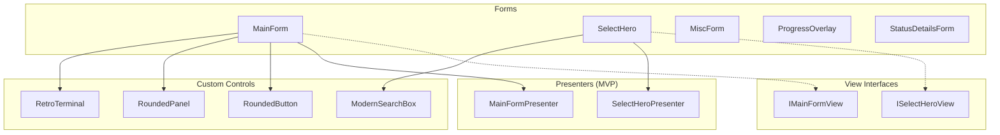

# UI Components Reference

Complete reference for UI components in `UI/`.

---

## Component Architecture



---

## Forms

### MainForm

**File:** `UI/Forms/MainForm.cs`

Main application window — hub for all mod operations.

#### UI Layout

| Section        | Components                                     |
| -------------- | ---------------------------------------------- |
| **Header**     | Logo, version, social links                    |
| **Detection**  | Auto Detect, Manual Detect buttons             |
| **Actions**    | Install, Disable, Patch Update, Cancel buttons |
| **Navigation** | Select Hero, Miscellaneous buttons             |
| **Status**     | Mod status indicator with details link         |
| **Console**    | Log output with copy button                    |

#### Key Methods

| Method                      | Description                                     |
| --------------------------- | ----------------------------------------------- |
| `Form1_Load`                | Initialize, check updates, start status refresh |
| `AutoDetectButton_Click`    | Auto-detect Dota 2 path                         |
| `InstallButton_Click`       | Install mods with progress overlay              |
| `DisableButton_Click`       | Disable mods with cleanup options               |
| `UpdatePatcherButton_Click` | Show patch mode menu                            |
| `CheckModsStatus`           | Refresh and display mod status                  |

---

### SelectHero

**File:** `UI/Forms/SelectHero.cs`

Hero selection grid for custom set generation.

#### Features

-  **Collapsible Accordion** — One hero expanded at a time
-  **Set Thumbnails** — Visual preview of available sets
-  **Favorites** — Star system for quick access
-  **Search & Filter** — By name and primary attribute
-  **Presets** — Save/load selection configurations

#### UI Layout

```
┌────────────────────────────────────────┐
│ [Search Box]  [Filter: All ▼]          │
├────────────────────────────────────────┤
│ ⭐ Anti-Mage          [Default Set ▼]  │
│ ▼ ────────────────────────────────     │
│   [Thumb1] [Thumb2] [Thumb3] ...       │
├────────────────────────────────────────┤
│   Invoker             [Dark Artistry ▼]│
│   Juggernaut          [Bladeform ▼]    │
│   ...                                  │
├────────────────────────────────────────┤
│ [Save Preset] [Load Preset] [Generate] │
└────────────────────────────────────────┘
```

#### Key Methods

| Method                     | Description                     |
| -------------------------- | ------------------------------- |
| `SelectHero_Shown`         | Load heroes.json, populate grid |
| `PopulateHeroes`           | Create hero row controls        |
| `Btn_SelectGenerate_Click` | Start generation pipeline       |
| `ApplyFilters`             | Filter by search/category       |
| `SaveSelectionsAsync`      | Persist selections to AppData   |

---

### MiscForm

**File:** `UI/Forms/MiscForm.cs`

Miscellaneous mod selection with categories.

#### Categories

-  **Environment** — Weather, terrain, water
-  **Audio & Visual** — Music, announcer, effects
-  **UI** — HUD, minimap, cursors

#### Key Methods

| Method                 | Description                           |
| ---------------------- | ------------------------------------- |
| `MiscForm_Load`        | Fetch remote config, populate options |
| `PopulateOptions`      | Create option rows by category        |
| `GenerateButton_Click` | Run misc generation                   |
| `GetSelections`        | Get current selections as dictionary  |

---

### ProgressOverlay

**File:** `UI/Forms/ProgressOverlay.cs`

WebView2-based animated progress display.

#### Features

-  HTML/CSS animations
-  Real-time progress bar
-  Stage text updates
-  Cancel support

#### Usage

```csharp
using var overlay = new ProgressOverlay(this);
overlay.Show();

await overlay.UpdateProgressAsync(25, "Downloading...");
await overlay.UpdateProgressAsync(50, "Extracting...");
await overlay.UpdateProgressAsync(100, "Complete!");

overlay.Close();
```

---

### StatusDetailsForm

**File:** `UI/Forms/StatusDetailsForm.cs`

Detailed mod status information dialog.

Displays:

-  Current status with icon
-  Version information
-  Installation timestamp
-  Gameinfo patch status
-  Signature status
-  Recommended action

---

### Other Forms

| Form                        | Purpose                        |
| --------------------------- | ------------------------------ |
| `GenerationPreviewForm`     | Preview before hero generation |
| `MiscGenerationPreviewForm` | Preview before misc generation |
| `InstallMethodDialog`       | Choose auto/manual install     |
| `RestartAppDialog`          | Prompt for app restart         |
| `SupportDialog`             | Donation/support info          |

---

## Custom Controls

### RoundedButton

**File:** `UI/Controls/RoundedButton.cs`

Modern rounded button with hover effects.

#### Properties

| Property         | Type    | Description                |
| ---------------- | ------- | -------------------------- |
| `BorderRadius`   | `int`   | Corner radius (default: 8) |
| `BorderColor`    | `Color` | Border color               |
| `BorderWidth`    | `int`   | Border thickness           |
| `HoverBackColor` | `Color` | Background on hover        |
| `PressBackColor` | `Color` | Background on press        |

#### Usage

```csharp
var button = new RoundedButton
{
    Text = "Install",
    BorderRadius = 12,
    BackColor = Color.FromArgb(45, 45, 48),
    HoverBackColor = Color.FromArgb(62, 62, 66),
    BorderColor = Color.FromArgb(0, 122, 204)
};
```

---

### RoundedPanel

**File:** `UI/Controls/RoundedPanel.cs`

Container panel with rounded corners.

---

### ModernSearchBox

**File:** `UI/Controls/ModernSearchBox.cs`

Styled search input control.

#### Features

-  Placeholder text
-  Clear button (X)
-  Search icon
-  Real-time `TextChanged` event

---

### RetroTerminal

**File:** `UI/Controls/RetroTerminal.cs`

Terminal-style log display.

#### Features

-  Monospace font (JetBrains Mono)
-  Auto-scroll
-  Color-coded output
-  Copy to clipboard

---

### CustomConsole

**File:** `UI/Controls/CustomConsole.cs`

Simple console output control.

---

### Dialog Controls

| Control                | Purpose                              |
| ---------------------- | ------------------------------------ |
| `DisableOptionsDialog` | Cleanup options when disabling       |
| `MiscModeDialog`       | Choose AddToCurrent or CleanGenerate |

---

## Presenters (MVP)

### MainFormPresenter

**File:** `UI/Presenters/MainFormPresenter.cs`

Business logic for MainForm.

#### Responsibilities

-  Dota 2 detection coordination
-  Install/disable orchestration
-  Status management
-  Update checking

#### Key Methods

| Method             | Description                 |
| ------------------ | --------------------------- |
| `DetectDota2Async` | Find Dota 2 installation    |
| `InstallModsAsync` | Coordinate mod installation |
| `DisableModsAsync` | Handle mod removal          |
| `CheckStatusAsync` | Validate and update status  |

---

### SelectHeroPresenter

**File:** `UI/Presenters/SelectHeroPresenter.cs`

Business logic for SelectHero form.

#### Responsibilities

-  Hero data loading from JSON
-  Generation pipeline coordination
-  Preset management
-  Selection state persistence

---

## View Interfaces

### IMainFormView

**File:** `UI/Interfaces/IMainFormView.cs`

```csharp
public interface IMainFormView
{
    string? TargetPath { get; set; }
    bool IsOperationRunning { get; }

    void SetStatus(string text);
    void AppendLog(string message);
    void ShowError(string title, string message);
    void UpdateModStatus(ModStatusInfo status);
    void EnableButtons();
    void DisableButtons();
}
```

### ISelectHeroView

**File:** `UI/Interfaces/ISelectHeroView.cs`

```csharp
public interface ISelectHeroView
{
    IReadOnlyList<(HeroModel hero, string setName)> GetSelections();

    void SetStatus(string text);
    void AppendLog(string message);
    void ShowProgress(int current, int total, string heroName);
    void EnableGenerate();
    void DisableGenerate();
}
```

---

## Theme & Styling

### Theme

**File:** `UI/Theme.cs`

Centralized color definitions.

```csharp
public static class Theme
{
    // Backgrounds
    public static Color Background => Color.FromArgb(30, 30, 30);
    public static Color Surface => Color.FromArgb(45, 45, 48);

    // Accent
    public static Color Primary => Color.FromArgb(0, 122, 204);
    public static Color Secondary => Color.FromArgb(62, 62, 66);

    // Text
    public static Color Text => Color.White;
    public static Color TextSecondary => Color.FromArgb(153, 153, 153);

    // Status
    public static Color Success => Color.FromArgb(76, 175, 80);
    public static Color Warning => Color.FromArgb(255, 152, 0);
    public static Color Error => Color.FromArgb(244, 67, 54);
}
```

### FontHelper

**File:** `UI/FontHelper.cs`

Manages embedded fonts.

```csharp
public static class FontHelper
{
    // JetBrains Mono for console
    public static Font CreateMono(float size, FontStyle style = FontStyle.Regular);

    // UI font
    public static Font CreateUI(float size, FontStyle style = FontStyle.Regular);
}
```

---

## Widget Controls

**Directory:** `UI/Controls/Widgets/`

Composite controls for complex UI:

-  Hero row widget (accordion item)
-  Misc option widget
-  Thumbnail tile
-  Collapsible sections
