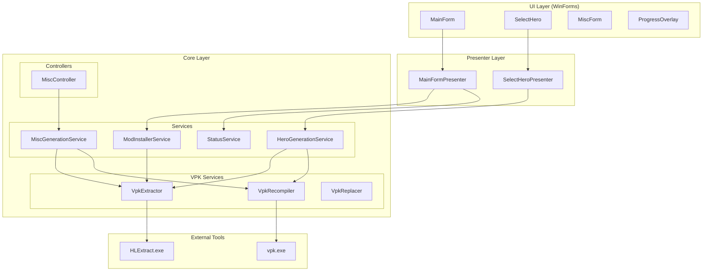
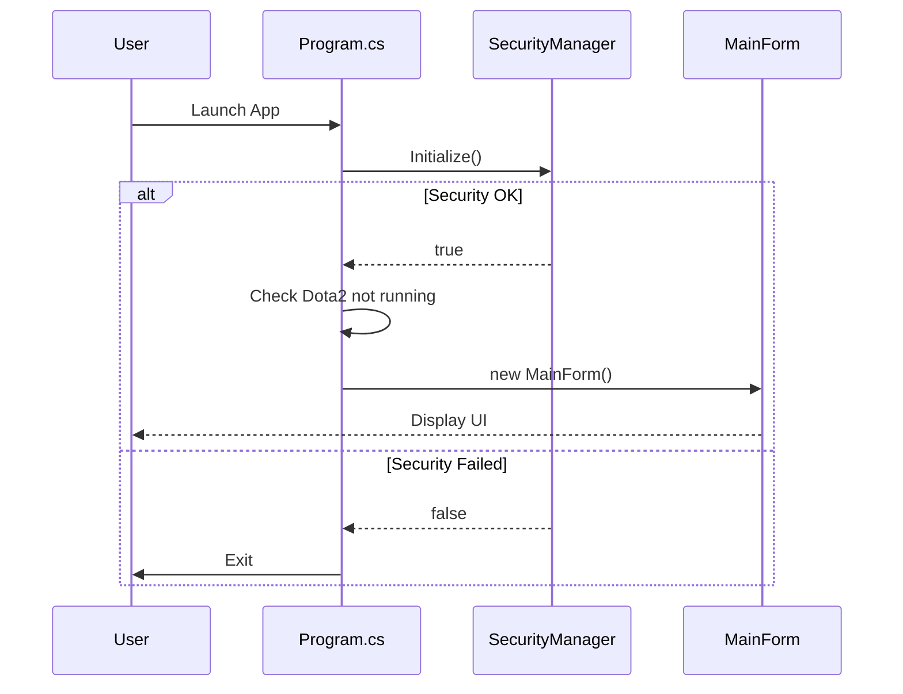
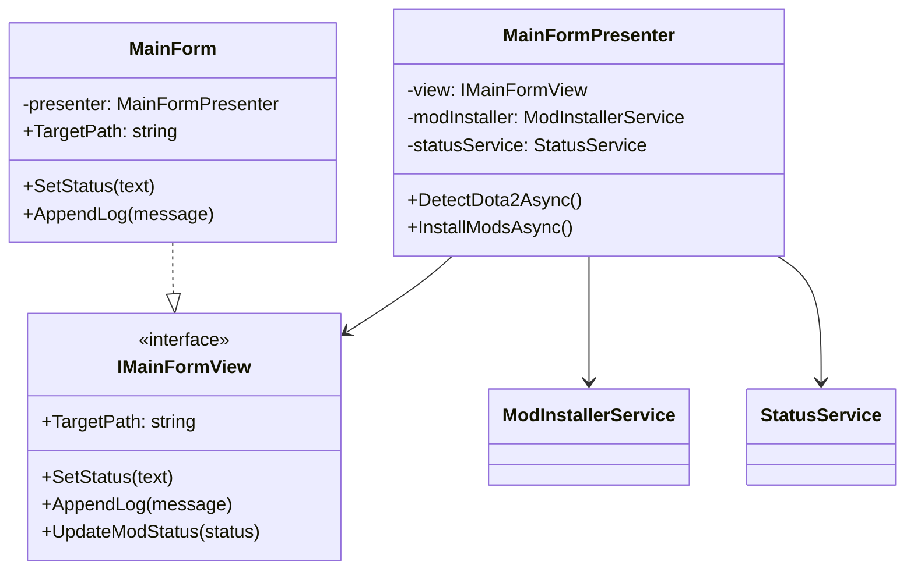
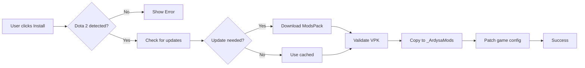
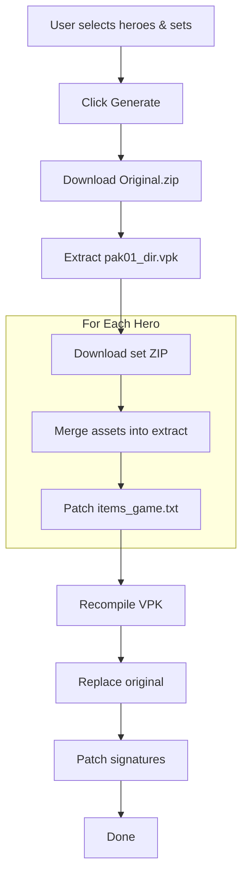
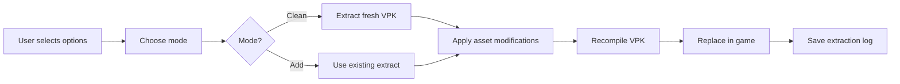
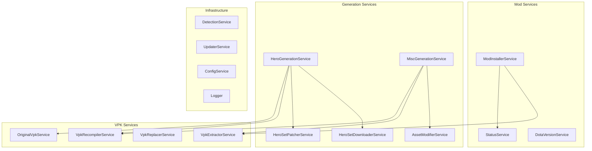
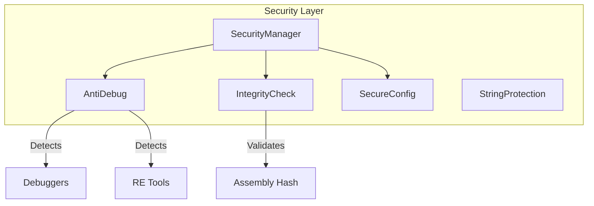

# Architecture Overview

AMT 2.0 follows a **layered architecture** with the **MVP (Model-View-Presenter)** pattern for UI components.

---

## System Architecture



---

## Layer Responsibilities

| Layer         | Purpose                      | Key Components                              |
| ------------- | ---------------------------- | ------------------------------------------- |
| **UI**        | User interaction, display    | Forms, Controls, Dialogs                    |
| **Presenter** | Business logic, coordination | MainFormPresenter, SelectHeroPresenter      |
| **Service**   | Domain operations            | ModInstaller, HeroGeneration, StatusService |
| **VPK**       | File operations              | Extractor, Recompiler, Replacer             |
| **External**  | Native tools                 | HLExtract.exe, vpk.exe                      |

---

## Component Relationships

### Entry Point Flow



### MVP Pattern



---

## Data Flow Diagrams

### Mod Installation Flow



### Hero Generation Flow



### Misc Generation Flow



---

## Service Layer Architecture



---

## Dependency Injection

Services are wired via `ServiceCollectionExtensions.cs`:

```csharp
public static class ServiceCollectionExtensions
{
    public static IServiceCollection AddArdysaServices(this IServiceCollection services)
    {
        // Infrastructure
        services.AddSingleton<ILogger, Logger>();
        services.AddSingleton<IStatusService, StatusService>();
        services.AddSingleton<ConfigService>();

        // Core Services
        services.AddTransient<ModInstallerService>();
        services.AddTransient<HeroGenerationService>();
        services.AddTransient<MiscGenerationService>();

        // VPK Services
        services.AddTransient<IVpkExtractor, VpkExtractorService>();
        services.AddTransient<IVpkRecompiler, VpkRecompilerService>();
        services.AddTransient<IVpkReplacer, VpkReplacerService>();

        return services;
    }
}
```

---

## Security Architecture



| Component            | Purpose                                       |
| -------------------- | --------------------------------------------- |
| **SecurityManager**  | Orchestrates all security checks at startup   |
| **AntiDebug**        | Detects debuggers, timing anomalies, RE tools |
| **IntegrityCheck**   | Validates assembly checksums                  |
| **SecureConfig**     | Encrypted configuration storage               |
| **StringProtection** | String obfuscation helpers                    |

---

## Configuration Management

| Service               | Storage                                    | Purpose            |
| --------------------- | ------------------------------------------ | ------------------ |
| `ConfigService`       | `%APPDATA%/ArdysaModsTools/config.json`    | General app config |
| `UserSettingsService` | `%APPDATA%/ArdysaModsTools/settings.json`  | User preferences   |
| `FavoritesStore`      | `%APPDATA%/ArdysaModsTools/favorites.json` | Favorite heroes    |
| `MainConfigService`   | `%APPDATA%/ArdysaModsTools/main.json`      | Window state       |

---

## Error Handling Strategy

All service operations return `OperationResult` or `OperationResult<T>`:

```csharp
public class OperationResult
{
    public bool Success { get; init; }
    public string? Message { get; init; }
    public Exception? Exception { get; init; }
    public List<(string name, string reason)>? FailedItems { get; init; }
}
```

**Exception Hierarchy:**

```
Exception
└── ArdysaException (base)
    ├── VpkException
    ├── DownloadException
    ├── PatchException
    ├── ConfigurationException
    └── GenerationException
```

See [Exceptions Reference](./exceptions.md) for error codes and handling.

---

## Logging System

**Dual-logger approach:**

| Logger           | Purpose                                 | Usage                     |
| ---------------- | --------------------------------------- | ------------------------- |
| `Logger`         | Full logging with rotation, async write | DI-injected services      |
| `FallbackLogger` | Static fallback for critical paths      | Global exception handlers |

```csharp
// Normal logging
_logger.Log("Starting installation...");
_logger.Log($"[VPK_001] Extraction failed: {ex.Message}");

// Fallback for critical paths
FallbackLogger.Log($"UnhandledException: {ex}");
```

---

## Design Decisions

| Decision               | Rationale                                                     |
| ---------------------- | ------------------------------------------------------------- |
| **MVP over MVVM**      | WinForms lacks proper data binding; MVP is more natural       |
| **Service layer**      | Separates business logic from UI for testability              |
| **OperationResult**    | Avoids exceptions for expected failures (network, user input) |
| **External VPK tools** | Native Valve tools are battle-tested; no need to reimplement  |
| **ConfuserEx**         | Mature obfuscator with anti-tamper for release builds         |
