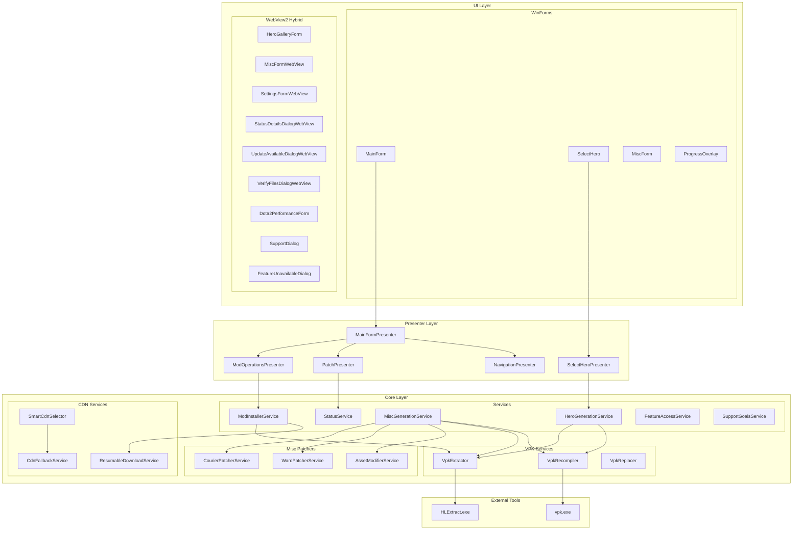
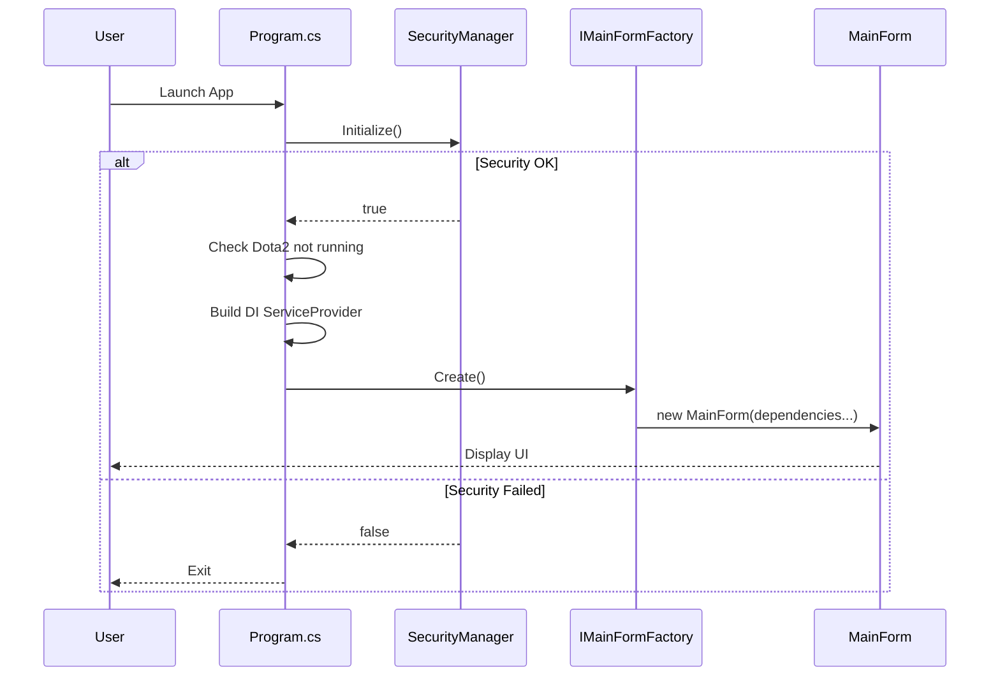
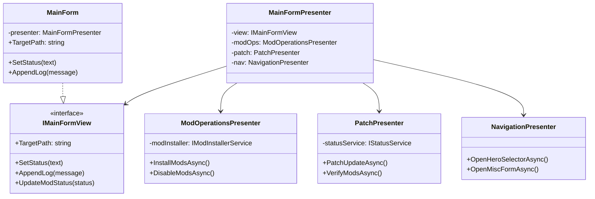
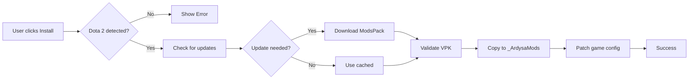
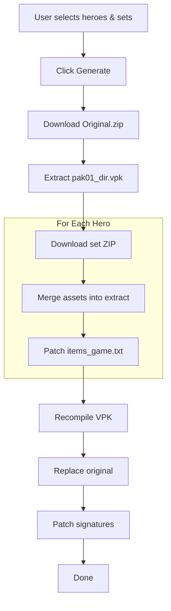
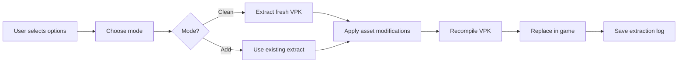
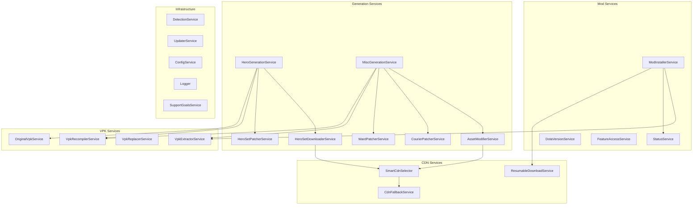
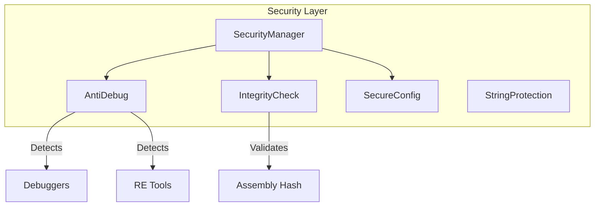

# Architecture Overview

AMT 2.0 follows a **layered architecture** with the **MVP (Model-View-Presenter)** pattern for UI components.

---

## System Architecture


```mermaid
graph TB
    subgraph UI["UI Layer"]
        subgraph WinForms["WinForms"]
            MF[MainForm]
            SH[SelectHero]
            MiscF[MiscForm]
            PO[ProgressOverlay]
        end
        subgraph WebView2["WebView2 Hybrid"]
            HGF[HeroGalleryForm]
            MFWV[MiscFormWebView]
            SFWV[SettingsFormWebView]
            SDDWV[StatusDetailsDialogWebView]
            UADWV[UpdateAvailableDialogWebView]
            VFDWV[VerifyFilesDialogWebView]
            D2PF[Dota2PerformanceForm]
            SD[SupportDialog]
            FUDWV[FeatureUnavailableDialog]
        end
    end

    subgraph Presenters["Presenter Layer"]
        MFP[MainFormPresenter]
        MOP[ModOperationsPresenter]
        PP[PatchPresenter]
        NP[NavigationPresenter]
        SHP[SelectHeroPresenter]
    end

    subgraph Core["Core Layer"]
        subgraph Services
            MIS[ModInstallerService]
            HGS[HeroGenerationService]
            MGS[MiscGenerationService]
            SS[StatusService]
            FAS[FeatureAccessService]
            SGS[SupportGoalsService]
        end
        subgraph MiscServices["Misc Patchers"]
            CPS[CourierPatcherService]
            WPS[WardPatcherService]
            AMS[AssetModifierService]
        end
        subgraph CdnServices["CDN Services"]
            SCS[SmartCdnSelector]
            CFS[CdnFallbackService]
            RDS[ResumableDownloadService]
        end
        subgraph VPK["VPK Services"]
            VE[VpkExtractor]
            VR[VpkRecompiler]
            VRep[VpkReplacer]
        end
    end

    subgraph External["External Tools"]
        HLE[HLExtract.exe]
        VPKT[vpk.exe]
    end

    MF --> MFP
    MFP --> MOP
    MFP --> PP
    MFP --> NP
    SH --> SHP
    MOP --> MIS
    PP --> SS
    SHP --> HGS
    MGS --> CPS
    MGS --> WPS
    MGS --> AMS
    MIS --> VE
    HGS --> VE
    HGS --> VR
    MGS --> VE
    MGS --> VR
    SCS --> CFS
    MIS --> RDS
    VE --> HLE
    VR --> VPKT
```

---

## Layer Responsibilities

| Layer         | Purpose                      | Key Components                                                    |
| ------------- | ---------------------------- | ----------------------------------------------------------------- |
| **UI**        | User interaction, display    | Forms, Controls, Dialogs, WebView2 HTML                           |
| **Presenter** | Business logic, coordination | MainForm, ModOperations, Patch, Navigation, SelectHero presenters |
| **Service**   | Domain operations            | ModInstaller, HeroGeneration, MiscGeneration, StatusService       |
| **CDN**       | Content delivery             | SmartCdnSelector, CdnFallbackService, ResumableDownloadService    |
| **VPK**       | File operations              | Extractor, Recompiler, Replacer                                   |
| **External**  | Native tools                 | HLExtract.exe, vpk.exe                                            |

---

## WebView2 UI Pattern

The project uses **WebView2** for modern UI components:

### Components Using WebView2

| Component                        | HTML File                  | Purpose                                      |
| -------------------------------- | -------------------------- | -------------------------------------------- |
| **HeroGalleryForm**              | `hero_gallery.html`        | Hero selection with sets grid                |
| **MiscFormWebView**              | `misc.html`                | Miscellaneous mod selection UI               |
| **ProgressOverlay**              | `progress.html`            | Progress bar, status, and ModsPack preview   |
| **SettingsFormWebView**          | `settings.html`            | App settings with cache control              |
| **StatusDetailsDialogWebView**   | `status_details.html`      | 4-step mod verification with animated checks |
| **UpdateAvailableDialogWebView** | `update_available.html`    | Version comparison and download cards        |
| **VerifyFilesDialogWebView**     | `verify_files.html`        | File integrity verification UI               |
| **Dota2PerformanceForm**         | `dota2_performance.html`   | FPS/quality/cvar tweaks and launch options   |
| **SupportDialog**                | `support.html`             | Ko-fi donation + YouTube subscriber goals    |
| **FeatureUnavailableDialog**     | `feature_unavailable.html` | Remote feature gating notification           |

### C# ↔ JavaScript Interop

**JavaScript → C# (Messages):**

```javascript
// From JavaScript
window.chrome.webview.postMessage({ type: "generate", data: { ... } });
window.chrome.webview.postMessage({ type: "close" });
window.chrome.webview.postMessage({ type: "startDrag" });
```

**C# → JavaScript (Script Execution):**

```csharp
// From C#
await _webView.CoreWebView2.ExecuteScriptAsync("loadHeroes(jsonData)");
await _webView.CoreWebView2.ExecuteScriptAsync("showAlert('Title', 'Message', 'success')");
await _webView.CoreWebView2.ExecuteScriptAsync("setVersion('2.0.16')");
```

### Message Handling Pattern

```csharp
private async void OnWebMessageReceived(object? sender, CoreWebView2WebMessageReceivedEventArgs e)
{
    var message = JsonSerializer.Deserialize<JsonElement>(e.WebMessageAsJson);
    var type = message.GetProperty("type").GetString();

    switch (type)
    {
        case "generate":
            await HandleGenerateAsync();
            break;
        case "close":
            this.Close();
            break;
        case "startDrag":
            ReleaseCapture();
            SendMessage(this.Handle, WM_NCLBUTTONDOWN, (IntPtr)HTCAPTION, IntPtr.Zero);
            break;
    }
}
```

### Borderless Window Dragging

For borderless WebView2 forms, window dragging is implemented via Windows API:

```csharp
[DllImport("user32.dll")]
private static extern bool ReleaseCapture();

[DllImport("user32.dll")]
private static extern IntPtr SendMessage(IntPtr hWnd, int Msg, IntPtr wParam, IntPtr lParam);

private const int WM_NCLBUTTONDOWN = 0xA1;
private const int HTCAPTION = 0x2;
```

---

## Component Relationships

### Entry Point Flow


```mermaid
sequenceDiagram
    participant User
    participant Program.cs
    participant SecurityManager
    participant IMainFormFactory
    participant MainForm

    User->>Program.cs: Launch App
    Program.cs->>SecurityManager: Initialize()
    alt Security OK
        SecurityManager-->>Program.cs: true
        Program.cs->>Program.cs: Check Dota2 not running
        Program.cs->>Program.cs: Build DI ServiceProvider
        Program.cs->>IMainFormFactory: Create()
        IMainFormFactory->>MainForm: new MainForm(dependencies...)
        MainForm-->>User: Display UI
    else Security Failed
        SecurityManager-->>Program.cs: false
        Program.cs-->>User: Exit
    end
```

### MVP Pattern (Decomposed Presenters)


```mermaid
classDiagram
    class IMainFormView {
        <<interface>>
        +TargetPath: string
        +SetStatus(text)
        +AppendLog(message)
        +UpdateModStatus(status)
    }

    class MainForm {
        -presenter: MainFormPresenter
        +TargetPath: string
        +SetStatus(text)
        +AppendLog(message)
    }

    class MainFormPresenter {
        -view: IMainFormView
        -modOps: ModOperationsPresenter
        -patch: PatchPresenter
        -nav: NavigationPresenter
    }

    class ModOperationsPresenter {
        -modInstaller: IModInstallerService
        +InstallModsAsync()
        +DisableModsAsync()
    }

    class PatchPresenter {
        -statusService: IStatusService
        +PatchUpdateAsync()
        +VerifyModsAsync()
    }

    class NavigationPresenter {
        +OpenHeroSelectorAsync()
        +OpenMiscFormAsync()
    }

    MainForm ..|> IMainFormView
    MainFormPresenter --> IMainFormView
    MainFormPresenter --> ModOperationsPresenter
    MainFormPresenter --> PatchPresenter
    MainFormPresenter --> NavigationPresenter
```

---

## Data Flow Diagrams

### Mod Installation Flow


```mermaid
flowchart LR
    A[User clicks Install] --> B{Dota 2 detected?}
    B -->|No| C[Show Error]
    B -->|Yes| D[Check for updates]
    D --> E{Update needed?}
    E -->|Yes| F[Download ModsPack]
    E -->|No| G[Use cached]
    F --> H[Validate VPK]
    G --> H
    H --> I[Copy to _ArdysaMods]
    I --> J[Patch game config]
    J --> K[Success]
```

### Hero Generation Flow


```mermaid
flowchart TB
    A[User selects heroes & sets] --> B[Click Generate]
    B --> C[Download Original.zip]
    C --> D[Extract pak01_dir.vpk]

    subgraph "For Each Hero"
        E[Download set ZIP]
        F[Merge assets into extract]
        G[Patch items_game.txt]
    end

    D --> E
    E --> F
    F --> G
    G --> H[Recompile VPK]
    H --> I[Replace original]
    I --> J[Patch signatures]
    J --> K[Done]
```

### Misc Generation Flow


```mermaid
flowchart LR
    A[User selects options] --> B[Choose mode]
    B --> C{Mode?}
    C -->|Clean| D[Extract fresh VPK]
    C -->|Add| E[Use existing extract]
    D --> F[Apply asset modifications]
    E --> F
    F --> G[Recompile VPK]
    G --> H[Replace in game]
    H --> I[Save extraction log]
```

---

## Service Layer Architecture


```mermaid
graph TB
    subgraph "Mod Services"
        MIS[ModInstallerService]
        SS[StatusService]
        DVS[DotaVersionService]
        FAS[FeatureAccessService]
    end

    subgraph "Generation Services"
        HGS[HeroGenerationService]
        HSDS[HeroSetDownloaderService]
        HSPS[HeroSetPatcherService]
        MGS[MiscGenerationService]
        AMS[AssetModifierService]
        CPS[CourierPatcherService]
        WPS[WardPatcherService]
    end

    subgraph "CDN Services"
        SCS[SmartCdnSelector]
        CFS[CdnFallbackService]
        RDS[ResumableDownloadService]
    end

    subgraph "VPK Services"
        VES[VpkExtractorService]
        VRS[VpkRecompilerService]
        VRepS[VpkReplacerService]
        OVS[OriginalVpkService]
    end

    subgraph "Infrastructure"
        DS[DetectionService]
        US[UpdaterService]
        CS[ConfigService]
        LS[Logger]
        SGS[SupportGoalsService]
    end

    MIS --> VES
    MIS --> SS
    MIS --> RDS
    HGS --> HSDS
    HGS --> HSPS
    HGS --> VRS
    HGS --> OVS
    HSDS --> SCS
    MGS --> AMS
    MGS --> CPS
    MGS --> WPS
    MGS --> VES
    MGS --> VRS
    AMS --> SCS
    SCS --> CFS
```

---

## Dependency Injection

Services are wired via `ServiceCollectionExtensions.cs` and resolved through constructor injection:

```csharp
public static class ServiceCollectionExtensions
{
    public static IServiceCollection AddArdysaServices(this IServiceCollection services)
    {
        // Infrastructure
        services.AddSingleton<ILogger, ProxyLogger>();
        services.AddSingleton<IStatusService, StatusService>();
        services.AddSingleton<IConfigService, ConfigService>();

        // Core Services
        services.AddTransient<IModInstallerService, ModInstallerService>();
        services.AddTransient<IDetectionService, DetectionService>();

        // Factory Pattern for WinForms
        services.AddSingleton<IMainFormFactory, MainFormFactory>();

        // VPK Services
        services.AddTransient<IVpkExtractor, VpkExtractorService>();
        services.AddTransient<IVpkRecompiler, VpkRecompilerService>();
        services.AddTransient<IVpkReplacer, VpkReplacerService>();

        return services;
    }
}
```

### MainForm Factory Pattern

WinForms cannot use constructor injection directly with `Application.Run()`. The factory pattern bridges DI with WinForms:

```csharp
// In Program.cs
var mainFormFactory = serviceProvider.GetRequiredService<IMainFormFactory>();
Application.Run(mainFormFactory.Create());

// MainFormFactory.cs
public MainForm Create()
{
    var configService = _serviceProvider.GetRequiredService<IConfigService>();
    var detectionService = _serviceProvider.GetRequiredService<IDetectionService>();
    // ... resolve all dependencies
    return new MainForm(configService, detectionService, ...);
}
```

---

## Security Architecture


```mermaid
graph TB
    subgraph "Security Layer"
        SM[SecurityManager]
        AD[AntiDebug]
        IC[IntegrityCheck]
        SC[SecureConfig]
        SP[StringProtection]
    end

    SM --> AD
    SM --> IC
    SM --> SC
    AD -->|Detects| DBG[Debuggers]
    AD -->|Detects| RE[RE Tools]
    IC -->|Validates| ASM[Assembly Hash]
```

| Component            | Purpose                                       |
| -------------------- | --------------------------------------------- |
| **SecurityManager**  | Orchestrates all security checks at startup   |
| **AntiDebug**        | Detects debuggers, timing anomalies, RE tools |
| **IntegrityCheck**   | Validates assembly checksums                  |
| **SecureConfig**     | Encrypted configuration storage               |
| **StringProtection** | String obfuscation helpers                    |

---

## Configuration Management

| Service               | Storage                                    | Purpose            |
| --------------------- | ------------------------------------------ | ------------------ |
| `ConfigService`       | `game/_ArdysaMods/_temp/config.json`       | General app config |
| `UserSettingsService` | `game/_ArdysaMods/_temp/settings.json`     | User preferences   |
| `FavoritesStore`      | `%AppData%/ArdysaModsTools/favorites.json` | Favorite heroes    |
| `MainConfigService`   | `game/_ArdysaMods/_temp/main.json`         | Window state       |

---

## CDN Configuration

Assets are served via multi-CDN with automatic fallback:

| Priority | CDN                  | Base URL                                               | Purpose            |
| -------- | -------------------- | ------------------------------------------------------ | ------------------ |
| 1        | **Cloudflare R2**    | `https://cdn.ardysamods.my.id`                         | Primary (fastest)  |
| 2        | jsDelivr             | `https://cdn.jsdelivr.net/gh/Anneardysa/ModsPack@main` | Fallback 1         |
| 3        | GitHub Raw           | `https://raw.githubusercontent.com/...`                | Fallback 2         |
| 4        | ghfast.top (proxy)   | `https://ghfast.top/...`                               | GFW proxy fallback |
| 5        | gh-proxy.com (proxy) | `https://gh-proxy.com/...`                             | GFW proxy fallback |

> [!NOTE]
> `SmartCdnSelector` runs a latency benchmark on first launch and auto-selects the fastest CDN for each user. If GitHub is fastest (e.g., for GFW users), it becomes primary automatically.

**Configuration in `CdnConfig.cs`:**

```csharp
public static class CdnConfig
{
    public const string R2BaseUrl = "https://cdn.ardysamods.my.id";
    public static bool IsR2Enabled { get; set; } = true;

    public static string[] GetCdnBaseUrls() => IsR2Enabled
        ? new[] { R2BaseUrl, JsDelivrBaseUrl, GitHubRawBaseUrl }
        : new[] { JsDelivrBaseUrl, GitHubRawBaseUrl };
}
```

---

## Error Handling Strategy

All service operations return `OperationResult` or `OperationResult<T>`:

```csharp
public class OperationResult
{
    public bool Success { get; init; }
    public string? Message { get; init; }
    public Exception? Exception { get; init; }
    public List<(string name, string reason)>? FailedItems { get; init; }
}
```

**Exception Hierarchy:**

```
Exception
└── ArdysaException (base)
    ├── VpkException
    ├── DownloadException
    ├── PatchException
    ├── ConfigurationException
    └── GenerationException
```

See [Exceptions Reference](./exceptions.md) for error codes and handling.

---

## Logging System

**Dual-logger approach:**

| Logger           | Purpose                                 | Usage                     |
| ---------------- | --------------------------------------- | ------------------------- |
| `Logger`         | Full logging with rotation, async write | DI-injected services      |
| `FallbackLogger` | Static fallback for critical paths      | Global exception handlers |

```csharp
// Normal logging
_logger.Log("Starting installation...");
_logger.Log($"[VPK_001] Extraction failed: {ex.Message}");

// Fallback for critical paths
FallbackLogger.Log($"UnhandledException: {ex}");
```

---

## Design Decisions

| Decision               | Rationale                                                     |
| ---------------------- | ------------------------------------------------------------- |
| **MVP over MVVM**      | WinForms lacks proper data binding; MVP is more natural       |
| **Service layer**      | Separates business logic from UI for testability              |
| **OperationResult**    | Avoids exceptions for expected failures (network, user input) |
| **External VPK tools** | Native Valve tools are battle-tested; no need to reimplement  |
| **ConfuserEx**         | Mature obfuscator with anti-tamper for release builds         |
