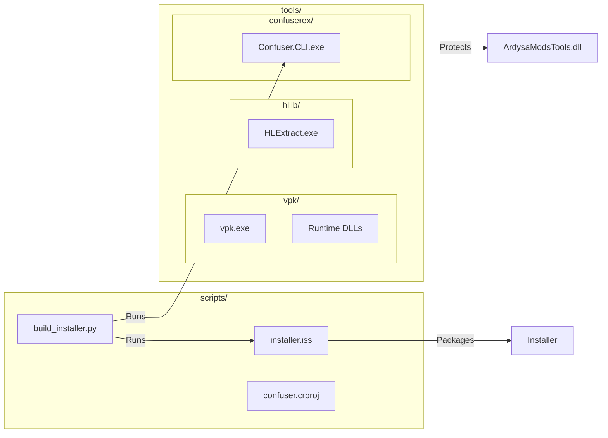

# Tools & Scripts Reference

Reference for build tools, scripts, and external binaries.

---

## Overview



---

## Build Script

### build_installer.py

**File:** `scripts/build_installer.py`

Primary build script for creating protected distribution builds.

#### What It Does

1. **Environment Check** — Validates .NET SDK, Inno Setup, ConfuserEx
2. **Clean** — Removes old build artifacts (handles locked files)
3. **Build** — Publishes Release build
4. **Protect** — Runs ConfuserEx obfuscation
5. **Package** — Compiles Inno Setup installer

#### Usage

```bash
cd D:\Projects\AMT2.0
python scripts/build_installer.py
```

#### Output

| Path                | Description                             |
| ------------------- | --------------------------------------- |
| `protected/`        | Obfuscated build ready for distribution |
| `installer_output/` | Generated installer EXE                 |

#### Requirements

-  Python 3.8+
-  .NET 8 SDK
-  Inno Setup 6 (for installer)
-  ConfuserEx (included in `tools/confuserex/`)

---

### installer.iss

**File:** `scripts/installer.iss`

Inno Setup script for Windows installer.

#### Features

-  Modern installer UI
-  Automatic uninstall of previous versions
-  Desktop shortcut creation
-  Start menu entry
-  Uninstaller registration

#### Build Manually

```bash
"C:\Program Files\Inno Setup 6\ISCC.exe" scripts\installer.iss
```

---

### confuser.crproj

**File:** `scripts/confuser.crproj`

ConfuserEx project configuration.

#### Protection Rules

```xml
<rule pattern="true" preset="none">
    <protection id="anti debug" />
    <protection id="anti dump" />
    <protection id="anti tamper" />
    <protection id="anti ildasm" />
</rule>
```

---

## External Tools

### VPK Tools (`tools/vpk/`)

Used for recompiling assets into Valve's VPK format.

#### vpk.exe

Valve's official VPK creation tool.

```bash
# Create VPK from directory
vpk.exe a output.vpk source_folder

# Example in code
await FileHelper.RunProcessCaptureAsync(
    "vpk.exe",
    $"a \"{outputPath}\" \"{sourceDir}\"",
    workingDir,
    ct);
```

#### Runtime DLLs

Required alongside vpk.exe:

| DLL                    | Purpose                |
| ---------------------- | ---------------------- |
| `tier0.dll`            | Source engine tier0    |
| `tier0_s.dll`          | Steam version          |
| `vstdlib.dll`          | Valve standard library |
| `vstdlib_s.dll`        | Steam version          |
| `filesystem_stdio.dll` | Source filesystem      |
| `zlib1.dll`            | Compression            |

---

### Extraction Tools (`tools/hllib/`)

Used for extracting game data from VPK archives.

#### HLExtract.exe

Half-Life Library extraction tool.

```bash
# Extract VPK to directory
HLExtract.exe -p pak01_dir.vpk -d output_folder -e root

# Extract specific path
HLExtract.exe -p pak01_dir.vpk -d output -e "scripts/items"
```

#### Options

| Flag        | Description                    |
| ----------- | ------------------------------ |
| `-p <file>` | Package file (VPK) to open     |
| `-d <dir>`  | Destination directory          |
| `-e <path>` | Path within package to extract |

#### Runtime DLLs

| DLL         | Purpose                |
| ----------- | ---------------------- |
| `HLLib.dll` | Half-Life Library core |

---

### Protection Tools (`tools/confuserex/`)

Code obfuscation and anti-tamper.

#### Confuser.CLI.exe

Command-line ConfuserEx.

```bash
# Run with project file
Confuser.CLI.exe -n project.crproj

# Options
#   -n    No pause after completion
```

---

## MSBuild Integration

The project file (`ArdysaModsTools.csproj`) includes targets for automatic protection:

### After Publish

```xml
<Target Name="RunConfuserExAfterPublish" AfterTargets="Publish">
    <!-- Auto-runs ConfuserEx on published output -->
</Target>
```

### With Installer

```bash
# Build with installer creation
dotnet publish -c Release -p:CreateInstaller=true
```

---

## Development Workflows

### Quick Build (Debug)

```bash
dotnet build -c Debug
```

### Release Build (No Protection)

```bash
dotnet publish -c Release -p:SkipInternalProtection=true
```

### Full Release (Protected + Installer)

```bash
python scripts/build_installer.py
```

---

## Tool Troubleshooting

### vpk.exe fails

1. Ensure all DLLs are present
2. Check source directory exists
3. Verify disk space available
4. Run from app directory (not system directory)

### HLExtract.exe fails

1. Check HLLib.dll is present
2. Verify VPK path is correct
3. Ensure destination is writable

### Confuser.CLI.exe fails

1. Check .NET 8 runtime probes in config
2. Verify input assembly exists
3. Check output directory writable

### Inno Setup fails

1. Install Inno Setup 6
2. Verify `protected/` folder exists
3. Check script paths are correct
