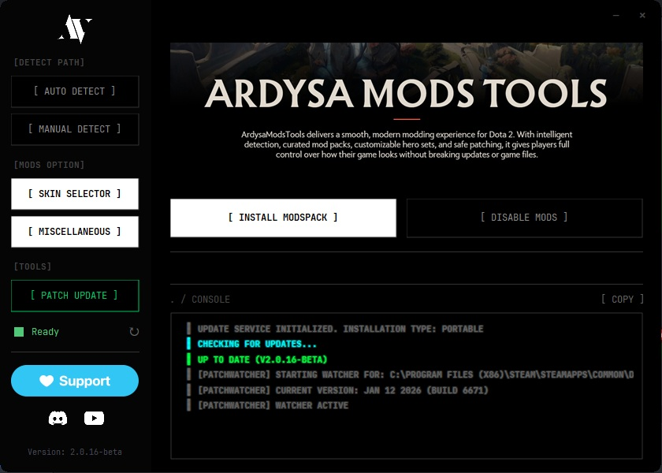
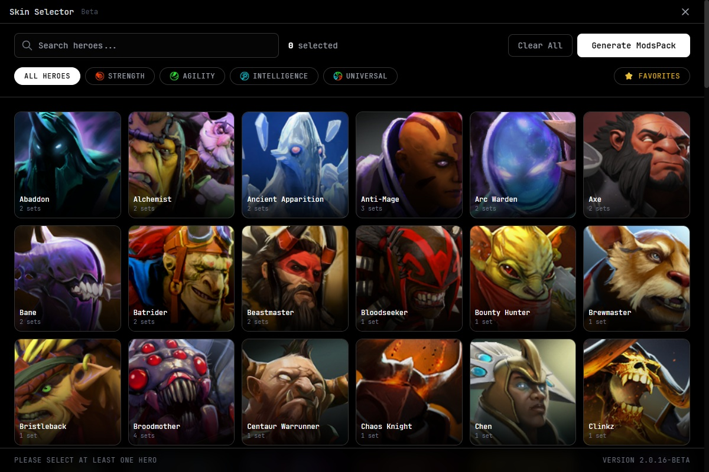
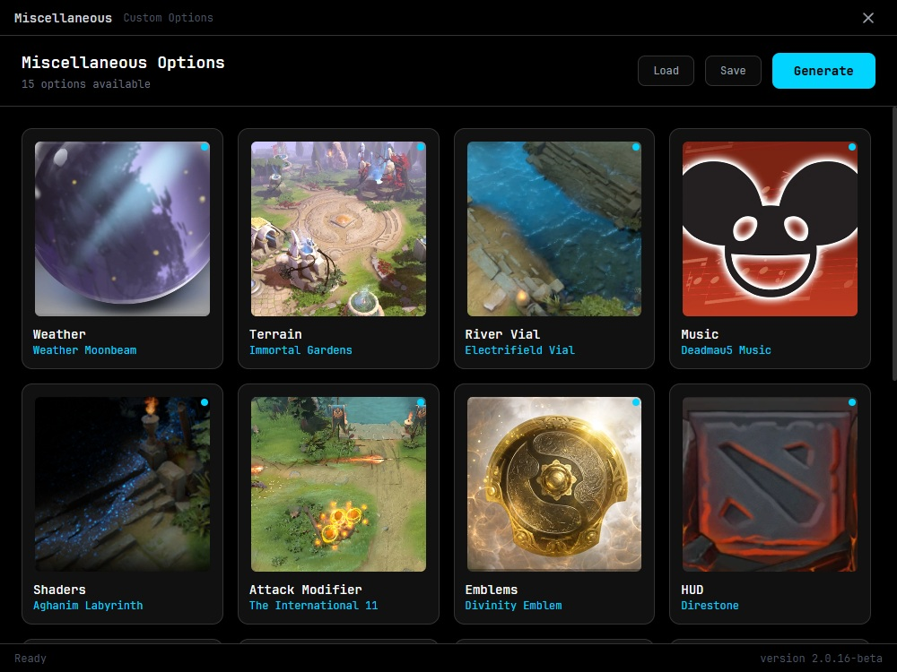

# ArdysaModsTools - Quick Start Guide

**Get started with AMT 2.0 in 5 minutes!**

---

## 📥 Installation

### Step 1: Download & Install

1. Download `ArdysaModsTools_Setup_x64.exe`
2. Run the installer as Administrator
3. Complete the installation wizard
4. Launch ArdysaModsTools

> [!TIP]
> The app is self-contained — .NET 8 runtime is bundled. No separate installation needed.
> If you see a WebView2 error, install the [WebView2 Runtime](https://developer.microsoft.com/microsoft-edge/webview2/).

---

## 🚀 First Time Setup

### Step 2: Detect Dota 2



1. Click **Auto Detect** button
2. Wait for automatic detection
3. If successful, path will appear in the field
4. If failed, click **Manual Select** and browse to:
   ```
   C:\Program Files (x86)\Steam\steamapps\common\dota 2 beta
   ```

### Step 3: Install Mods

1. Click **Install** button
2. Choose **Auto Install**
3. Wait for download and installation
4. Status will show "Ready" (green) when complete

### Step 4: Play!

Launch Dota 2 normally and enjoy your mods! 🎮

---

## 🎯 Basic Features

### Install/Update Mods

```
Main Window → Install → Auto Install → Done
```

**After Dota 2 updates**:

```
Patch Update → Done
```

### Create Custom Hero Skins

```
Select Hero → Choose hero → Select set → Generate → Wait
```



1. Click **Select Hero** from main window
2. Find your hero (use search or scroll)
3. Click hero card and choose a set from dropdown
4. Repeat for multiple heroes if desired
5. Click **Generate**
6. Wait 2-5 minutes per hero

### Add Miscellaneous Mods

```
Miscellaneous → Select options → Generate → Done
```



1. Click **Miscellaneous** from main window
2. Choose generation mode:
   - **Clean Generate**: Start fresh
   - **Add to Current**: Add to existing mods
3. Select weather, terrain, HUD, or audio options
4. Click **Generate**

---

## 🔧 Common Tasks

### Disable Mods Temporarily

```
Disable button → Confirm
```

To re-enable: Click **Install** again

### Remove Mods Completely

```
1. Disable button
2. Verify Dota 2 files in Steam (optional)
```

### Update After Game Patch

```
Patch Update → Done
```

---

## ❗ Quick Troubleshooting

| Problem            | Solution                             |
| ------------------ | ------------------------------------ |
| Can't launch AMT   | Close Dota 2 first                   |
| Auto detect failed | Use Manual Select                    |
| Mods not showing   | Click Patch Update                   |
| After game update  | Click Patch Update                   |
| Error messages     | Copy console logs and ask in Discord |

---

## 📊 Status Indicators

- 🟢 **Green "Ready"** = Everything working perfectly
- 🟠 **Orange "Need Update"** = Needs patching (run Patch Update)
- 🔴 **Red "Error"** = Problem detected (check console)
- ⚫ **Gray** = Not installed or disabled

---

## 💡 Pro Tips

1. **Star your favorite heroes** - They appear at the top for quick access
2. **Generate multiple heroes at once** - Select sets for several heroes before clicking Generate
3. **Copy console logs** - Use the Copy button for debugging
4. **Run as Admin** - If you encounter permission issues
5. **After every Dota update** - Run Patch Update to keep mods working

---

## 🆘 Need Help?

- 💬 Join our Discord: [discord.gg/ffXw265Z7e](https://discord.gg/ffXw265Z7e)
- 📺 Watch tutorials: [youtube.com/@ardysa](https://youtube.com/@ardysa)
- 📖 Read full guide: See [USER_GUIDE.md](USER_GUIDE.md)

---

## ⚠️ Important Notes

> Always close Dota 2 before using AMT

> Use at your own risk - cosmetic mods only

> Backup important files before modding

> Run Patch Update after each Dota 2 update

---

**You're all set! Enjoy your customized Dota 2! 🎉**
