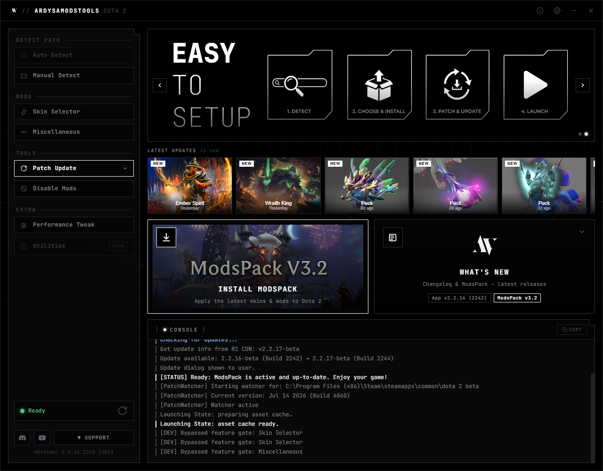
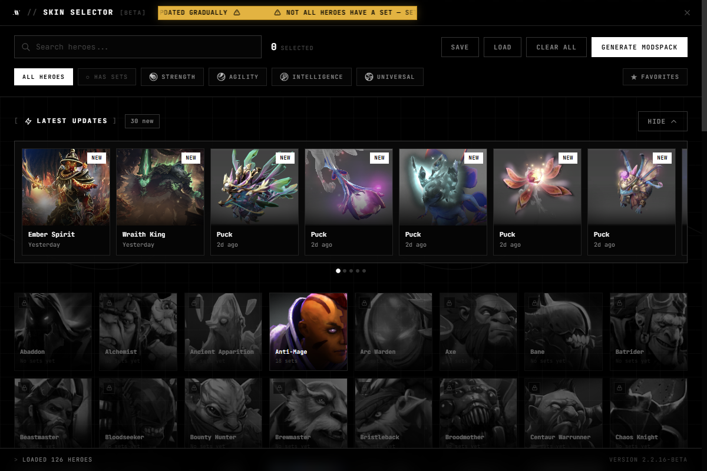
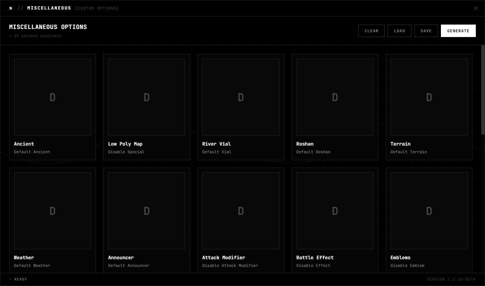

# ArdysaModsTools - Quick Start Guide

**Get started with AMT 2.0 in 5 minutes!**

---

## 📥 Installation

### Step 1: Download & Install

1. Download `ArdysaModsTools_Setup_x64.exe`
2. Run the installer as Administrator
3. Complete the installation wizard
4. Launch ArdysaModsTools

> [!TIP]
> The app is self-contained — .NET 8 runtime is bundled. No separate installation needed.
> If you see a WebView2 error, install the [WebView2 Runtime](https://developer.microsoft.com/microsoft-edge/webview2/).

---

## 🚀 First Time Setup

### Step 2: Detect Dota 2



1. Click **Auto Detect** button
2. Wait for automatic detection
3. If successful, path will appear in the field
4. If failed, click **Manual Select** and browse to:
   ```
   C:\Program Files (x86)\Steam\steamapps\common\dota 2 beta
   ```

### Step 3: Install Mods

1. Click **Install** button
2. Choose **Auto Install**
3. Wait for download and installation
4. Status will show "Ready" (green) when complete

### Step 4: Press PLAY DOTA 2

```
PLAY DOTA 2 → done
```

Start the game from AMT, not from Steam. The button waits out any pending Dota 2 update,
rebuilds your mod package for the new version, and then launches — that's what stops the
crash-on-startup you get after a Valve patch. Nothing is redownloaded; it repairs from data
already on your disk.

If an update landed, AMT asks before launching (*"Dota 2 has been updated — start it now?"*)
so a long patch doesn't start the game while you're away. Everything before that is automatic.

---

## 🎯 Basic Features

### Install/Update Mods

```
Main Window → Install → Auto Install → Done
```

**After Dota 2 updates**:

```
Patch Update → PLAY DOTA 2 → Done
```

Two different repairs: **Patch Update** restores the game config so mods load at all;
**Play Dota 2** rebuilds the mod package so it matches the new game version. The status chips
tell you which one is outstanding.

### Create Custom Hero Skins

```
Select Hero → Choose hero → Select set → Generate → Wait
```



1. Click **Select Hero** from main window
2. Find your hero (use search or scroll)
3. Click hero card and choose a set from dropdown
4. Repeat for multiple heroes if desired
5. Click **Generate**
6. Wait 2-5 minutes per hero

### Add Miscellaneous Mods

```
Miscellaneous → Select options → Generate → Done
```



1. Click **Miscellaneous** from main window
2. Choose generation mode:
   - **Clean Generate**: Start fresh
   - **Add to Current**: Add to existing mods
3. Select weather, terrain, HUD, or audio options
4. Click **Generate**

---

## 🔧 Common Tasks

### Disable Mods Temporarily

```
Disable button → Confirm
```

To re-enable: Click **Install** again

### Remove Mods Completely

```
1. Disable button
2. Verify Dota 2 files in Steam (optional)
```

### Update After Game Patch

```
Patch Update → Done
```

---

## ❗ Quick Troubleshooting

| Problem                       | Solution                                    |
| ----------------------------- | ------------------------------------------- |
| Can't launch AMT              | Close Dota 2 first                          |
| Auto detect failed            | Use Manual Select                           |
| Mods not showing              | Patch Update, then **PLAY DOTA 2**          |
| Dota 2 crashes on startup     | **PLAY DOTA 2** — it rebuilds the package   |
| **Package Sync** chip is red  | Normal after a Dota 2 patch. **PLAY DOTA 2** clears it |
| **Process Elevation** chip is red | Restart AMT as Administrator            |
| Error messages                | Copy console logs and ask in Discord        |

---

## 📊 Status Indicators

- 🟢 **Green "Ready"** = Everything working perfectly
- 🟠 **Orange "Need Update"** = Needs patching (run Patch Update)
- 🔴 **Red "Error"** = Problem detected (check console)
- ⚫ **Gray** = Not installed or disabled

---

## 💡 Pro Tips

1. **Always start the game with PLAY DOTA 2** — it's the whole point of the button
2. **Star your favorite heroes** — they pin to the top for quick access
3. **Generate multiple heroes at once** — select sets for several heroes before hitting Generate
4. **Copy console logs** — use the Copy button when reporting anything
5. **Run as Admin** — if the Process Elevation chip is red
6. **Set your language and theme** — Settings, applies instantly

---

## 🆘 Need Help?

- 💬 Join our Discord: [discord.gg/5xKg4fyumv](https://discord.gg/5xKg4fyumv)
- 📺 Watch tutorials: [youtube.com/@ardysa](https://youtube.com/@ardysa)
- 📖 Read full guide: See [USER_GUIDE.md](USER_GUIDE.md) (includes FAQ)

---

## ⚠️ Important Notes

> Always close Dota 2 before using AMT

> Use at your own risk - cosmetic mods only

> Backup important files before modding

> Run Patch Update after each Dota 2 update

---

**You're all set! Enjoy your customized Dota 2! 🎉**
