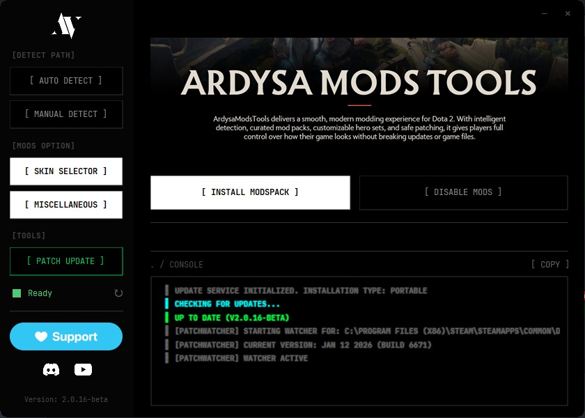
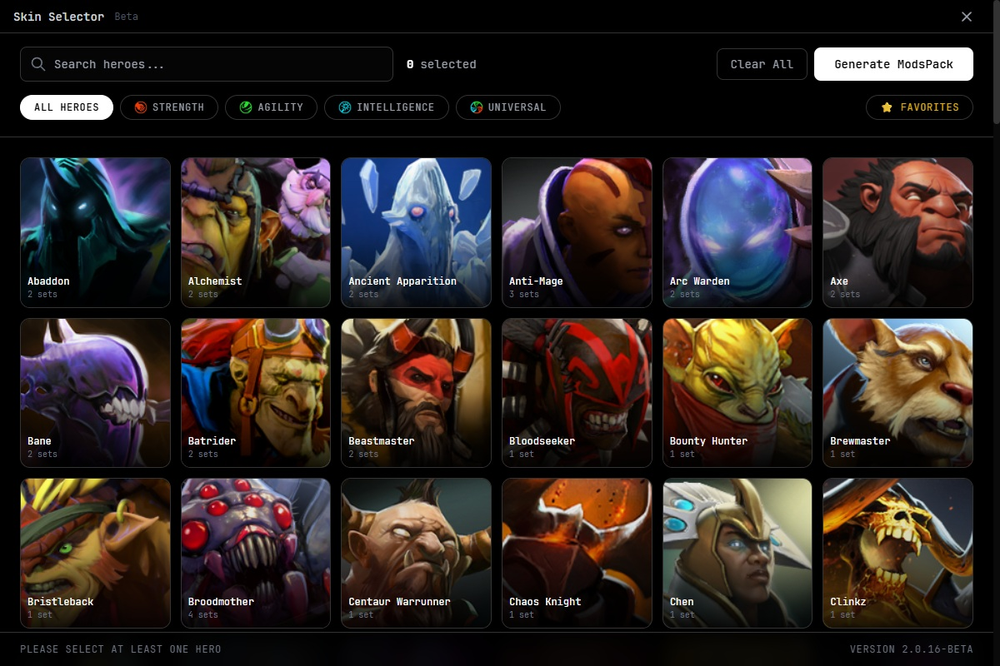
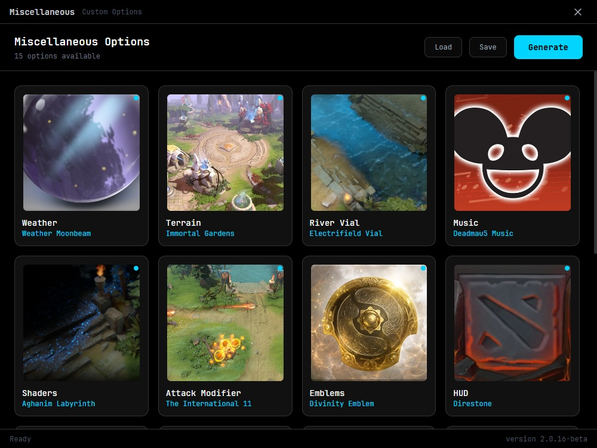

# ArdysaModsTools User Guide

**Version 2.0** | The Ultimate Dota 2 Mod Manager

---

## Table of Contents

1. [What is ArdysaModsTools?](#what-is-ardysamodstools)
2. [System Requirements](#system-requirements)
3. [Installation](#installation)
4. [Getting Started](#getting-started)
5. [Features Overview](#features-overview)
6. [Main Features](#main-features)
   -  [Mod Installation](#mod-installation)
   -  [Hero Set Generation](#hero-set-generation)
   -  [Miscellaneous Mods](#miscellaneous-mods)
7. [Advanced Features](#advanced-features)
8. [Troubleshooting](#troubleshooting)
9. [FAQ](#faq)
10.   [Support & Community](#support--community)

---

## What is ArdysaModsTools?

**ArdysaModsTools (AMT 2.0)** is a powerful Windows desktop application designed to help Dota 2 players easily install and manage custom cosmetic modifications. With AMT 2.0, you can:

-  🎮 **Install curated mod packs** with one click
-  🦸 **Create custom hero skins** from community sets
-  🌦️ **Customize weather, terrain, and HUD** elements
-  🔄 **Keep mods working** after game updates
-  🔧 **Auto-detect** your Dota 2 installation

> [!IMPORTANT]
> This tool **only modifies cosmetic elements** and does not affect gameplay. Use at your own risk. Always backup your game files before modding.

---

## System Requirements

| Component                | Requirement                          |
| ------------------------ | ------------------------------------ |
| **Operating System**     | Windows 10/11 (64-bit)               |
| **.NET Desktop Runtime** | 8.0 or higher                        |
| **Disk Space**           | 500 MB free (for temporary files)    |
| **Dota 2**               | Installed via Steam                  |
| **Administrator Rights** | Required for game file modifications |

> [!NOTE]
> The installer will automatically check for .NET 8 and guide you to install it if needed.

---

## Installation

### Download & Install

1. **Download the Installer**

   -  Get `ArdysaModsTools_Setup_x64.exe` from the official source

2. **Run the Installer**

   -  Right-click the installer and select **Run as Administrator**
   -  Follow the installation wizard

3. **Dependency Check**

   -  The installer will check for .NET 8 Desktop Runtime
   -  If not found, you'll be prompted to download it
   -  After installing .NET 8, run the AMT installer again

4. **Complete Installation**

   -  Choose installation location (default: `C:\Program Files\ArdysaModsTools`)
   -  Optionally create a desktop shortcut
   -  Click **Install**

5. **Launch Application**
   -  Check **Launch ArdysaModsTools** at the end of installation
   -  Or launch from Start Menu or Desktop shortcut

> [!WARNING] > **Important**: Close Dota 2 completely before launching ArdysaModsTools. The application cannot run while Dota 2 is active.

### Updating

When a new version is available:

-  The application will notify you automatically
-  Download the new installer
-  The installer will automatically remove the old version before installing the new one

---

## Getting Started

### First Launch

When you first launch ArdysaModsTools, follow these steps:

#### Step 1: Detect Dota 2 Installation

The application needs to know where Dota 2 is installed on your computer.

**Option A: Auto Detect (Recommended)**

1. Click the **Auto Detect** button
2. The app will search common locations and Steam libraries
3. If found, the path will appear in the target path field
4. Status will show "Detected successfully"

**Option B: Manual Selection**

1. Click the **Manual Select** button
2. Navigate to your Dota 2 installation folder
   -  Default: `C:\Program Files (x86)\Steam\steamapps\common\dota 2 beta`
3. Select the `dota 2 beta` folder
4. Click **OK**

> [!TIP]
> If auto-detection fails, your Dota 2 might be installed in a custom Steam library. Use manual selection to locate it.

#### Step 2: Install Mods

Once Dota 2 is detected:

1. Click the **Install** button
2. Choose installation method:
   -  **Auto Install**: Download the latest mod pack from the server (recommended)
   -  **Manual Install**: Use a VPK file you already have
3. Wait for the installation to complete
4. Status will show "Ready" in green when successful

#### Step 3: Launch Dota 2

The mods are now installed! Launch Dota 2 normally and enjoy your customized game.

---

## Features Overview

ArdysaModsTools offers three main features:

| Feature           | Description                                  | Button Color |
| ----------------- | -------------------------------------------- | ------------ |
| **Install Mods**  | Download and install the main mod pack       | Blue         |
| **Select Hero**   | Create custom hero skins from community sets | Purple       |
| **Miscellaneous** | Customize weather, terrain, HUD, and more    | Orange       |

---

## Main Features

### Mod Installation

The primary feature is installing curated mod packs that include multiple cosmetic enhancements.

#### Installing Mods

1. **Click Install** button
2. **Choose Auto Install** for the latest mods from the server
3. The application will:
   -  Download the latest ModsPack
   -  Validate the VPK file
   -  Copy to your Dota 2 folder (`game/dota/_ArdysaMods/`)
   -  Patch game configuration files for mod compatibility
4. Monitor progress in the console at the bottom
5. When complete, status shows **Ready** (green)

#### Auto Install vs Manual Install

**Auto Install**:

-  Always gets the latest version
-  Automatic validation
-  Recommended for most users

**Manual Install**:

-  Use if you have a specific VPK file
-  Must contain `_ArdysaMods` marker to be valid
-  Useful for offline installation

#### Disabling Mods

To temporarily disable mods without uninstalling:

1. Click the **Disable** button
2. This will restore original game configuration
3. Mod files remain in place
4. Click **Install** again to re-enable

#### Updating Mods

When game updates or new mod versions are available:

1. Status indicator will show **Need Update** (orange)
2. Click the **Patch Update** button
3. Choose patch mode:
   -  **Quick Patch**: Fast, updates signatures only (use after game updates)
   -  **Full Patch**: Complete re-patch of all files

> [!IMPORTANT]
> After each Dota 2 game update, run **Quick Patch** to ensure mods continue working properly.

---

### Hero Set Generation

Create custom hero skins by selecting from community-created cosmetic sets.

#### How It Works

The Hero Set Generator:

1. Downloads base game files
2. Merges custom set assets (models, textures, particles)
3. Patches item definitions
4. Recompiles into a VPK file
5. Replaces the original

#### Using Hero Set Generation

1. **Click Select Hero** button from main window
2. **Browse Heroes**:
   -  Scroll through the grid of hero portraits
   -  Use the search bar to find specific heroes
   -  Click the star icon to favorite heroes
3. **Select Sets**:
   -  Click a hero card
   -  Choose a set from the dropdown menu
   -  Available sets are displayed with names
4. **Add Multiple Heroes**:
   -  Select as many heroes as you want
   -  Each hero can have one active set
5. **Generate**:
   -  Click the **Generate** button
   -  Wait for the process to complete (may take several minutes)
   -  Monitor progress in the console

#### Batch Generation

You can generate multiple heroes at once:

-  Select sets for multiple heroes
-  Click **Generate**
-  The application processes them sequentially
-  Progress bar shows overall completion

#### Favorites System

Mark frequently used heroes as favorites:

-  Click the star icon on any hero card
-  Favorites appear at the top of the list
-  Easier access to your preferred heroes

> [!TIP]
> Hero set generation can take 2-5 minutes per hero depending on set size. Plan accordingly when generating multiple heroes.

---

### Miscellaneous Mods

Customize additional game elements beyond hero skins.

#### Available Categories

**🌦️ Weather Effects**

-  Moonbeam
-  Aurora
-  Snow
-  Ash
-  Pestilence
-  And more...

**🗺️ Terrain/Map**

-  Custom map skins
-  Different visual themes

**🎨 HUD Modifications**

-  Interface customizations
-  UI element replacements

**🔊 Audio Mods**

-  Custom sound effects
-  Music replacements

#### Using Miscellaneous Mods

1. **Click Miscellaneous** button from main window
2. **Choose Generation Mode**:
   -  **Clean Generate**: Start fresh, replaces all existing misc mods
   -  **Add to Current**: Merge with existing modifications
3. **Select Options**:
   -  Browse through categories
   -  Check boxes or select from dropdowns
   -  Multiple selections allowed
4. **Apply Changes**:
   -  Click **Generate** or **Apply** button
   -  Wait for compilation
   -  Status will confirm completion

#### Generation Modes Explained

| Mode               | When to Use                        | Effect                                         |
| ------------------ | ---------------------------------- | ---------------------------------------------- |
| **Clean Generate** | First time, or reset all changes   | Extracts fresh VPK, applies only selected mods |
| **Add to Current** | Adding more mods to existing setup | Uses existing extraction, adds new mods        |

> [!NOTE]
> Clean Generate takes longer but ensures a clean slate. Use Add to Current for quick additions.

---

## Advanced Features

### Patch Management

After Dota 2 game updates, some files may need re-patching:

1. **Automatic Detection**:

   -  Application checks mod status on launch
   -  Status indicator shows:
      -  **Ready** (Green): Everything working
      -  **Need Update** (Orange): Patch required
      -  **Error** (Red): Issue detected

2. **Manual Patching**:
   -  Click **Patch Update** button
   -  Choose **Quick Patch** for post-update fixes
   -  Choose **Full Patch** for complete re-installation

### Verification

To verify mod installation integrity:

1. Right-click the **Patch Update** button
2. Select **Verify Mod Files**
3. The application checks:
   -  Presence of all required files
   -  VPK integrity
   -  Configuration patches
4. View detailed status report

### Console Logs

The console at the bottom shows real-time operation logs:

-  Download progress
-  File operations
-  Errors and warnings
-  Completion status

**Copy Logs**:

-  Click the **Copy** button above console
-  Paste logs when reporting issues

### Clear Temp Files

To free up disk space:

-  The application stores temporary files during operations
-  These are automatically cleaned on exit
-  Manual cleanup happens during reinstall

---

## Troubleshooting

### Common Issues

#### Issue: Can't Launch Application

**Error**: "Cannot run while dota2.exe is active"

**Solution**:

-  Close Dota 2 completely
-  Check Task Manager for `dota2.exe` process
-  End the process if found
-  Launch AMT again

---

#### Issue: Auto Detect Fails

**Error**: "Could not detect Dota 2"

**Solutions**:

1. Use **Manual Select** instead
2. Check Dota 2 is installed via Steam
3. Verify installation by launching Dota 2 from Steam
4. Try detecting again after verifying

---

#### Issue: Installation Fails

**Error**: Various installation errors

**Solutions**:

1. **Run as Administrator**: Right-click app icon → Run as Administrator
2. **Check Disk Space**: Ensure at least 500MB free
3. **Disable Antivirus**: Temporarily disable if blocking VPK operations
4. **Verify Dota 2**: Right-click Dota 2 in Steam → Properties → Local Files → Verify Integrity
5. **Check Logs**: Copy console logs and see specific error

---

#### Issue: Mods Not Visible In-Game

**Problems**: Installed mods don't appear in Dota 2

**Solutions**:

1. **Check Status**: Status should show "Ready" (green)
2. **Run Patch**: Click Patch Update → Full Patch
3. **Restart Dota 2**: Completely exit and relaunch
4. **Verify Installation**:
   -  Check folder exists: `dota 2 beta/game/dota/_ArdysaMods/`
   -  Check `pak01_dir.vpk` is present
5. **Reinstall**: Click Disable, then Install again

---

#### Issue: Game Update Breaks Mods

**Problem**: After Dota 2 update, mods stop working

**Solution**:

1. Launch AMT
2. Status will show "Need Update" (orange)
3. Click **Patch Update** → **Quick Patch**
4. Wait for completion
5. Relaunch Dota 2

---

#### Issue: .NET 8 Not Found

**Error**: "Requires .NET 8 Desktop Runtime"

**Solution**:

1. Click **Yes** when prompted to download
2. Download from: https://dotnet.microsoft.com/download/dotnet/8.0
3. Install **Desktop Runtime (x64)**
4. Run AMT installer again

---

### Performance Issues

#### Slow Generation

Hero set generation taking very long:

**Causes**:

-  Large set files
-  Slow internet connection (for downloads)
-  Antivirus scanning VPK operations

**Solutions**:

-  Be patient (2-5 minutes per hero is normal)
-  Ensure stable internet connection
-  Exclude AMT folder from antivirus scanning
-  Close other applications

---

### Error Messages

| Error          | Meaning                | Solution                              |
| -------------- | ---------------------- | ------------------------------------- |
| `VPK_001`      | VPK extraction failed  | Verify tools folder exists            |
| `VPK_002`      | VPK compilation failed | Check permissions, try as admin       |
| `DOWNLOAD_001` | Download failed        | Check internet, retry                 |
| `PATCH_001`    | Gameinfo patch failed  | Verify Dota 2 installation            |
| `GEN_001`      | Hero generation failed | Check specific hero, try individually |

> [!TIP]
> Always copy console logs when reporting errors. Click the **Copy Console** button and paste when asking for help.

---

## FAQ

### General Questions

**Q: Is this safe to use?**  
A: AMT only modifies cosmetic files and does not affect gameplay. However, use at your own risk. While cosmetic mods are generally accepted, Valve's stance may change.

**Q: Can I get VAC banned?**  
A: Cosmetic mods typically do not trigger VAC bans as they don't affect gameplay. However, we cannot guarantee immunity. Use at your own discretion.

**Q: Does this work with Mac/Linux?**  
A: No, AMT 2.0 is Windows-only. It requires Windows 10/11 (64-bit) and .NET 8.

**Q: Can I use this on Dota 2 Reborn?**  
A: Yes, AMT 2.0 is designed for the current version of Dota 2 (Source 2/Reborn).

**Q: Is this free?**  
A: Yes, ArdysaModsTools is completely free. Donations are appreciated to support development.

---

### Technical Questions

**Q: Where are mods installed?**  
A: Mods are installed in: `dota 2 beta/game/dota/_ArdysaMods/pak01_dir.vpk`

**Q: Where are logs saved?**  
A: Logs are in: `%APPDATA%/ArdysaModsTools/logs/`

**Q: Where are settings saved?**  
A: Settings are in: `%APPDATA%/ArdysaModsTools/` (config.json, settings.json, etc.)

**Q: Can I backup my mods?**  
A: Yes, backup the `_ArdysaMods` folder and your AMT settings folder.

**Q: How do I completely uninstall?**  
A:

1. Click **Disable** in AMT to restore original files
2. Uninstall via Windows Settings → Apps
3. Optionally delete `%APPDATA%/ArdysaModsTools/` folder

---

### Feature Questions

**Q: Can I use multiple hero sets at once?**  
A: Yes! That's the main benefit. Select different sets for different heroes and generate them all.

**Q: Can I mix hero sets with misc mods?**  
A: Yes, they work independently. Hero sets modify `pak01_dir.vpk`, misc mods also use the same VPK but different content.

**Q: How do I reset to vanilla Dota 2?**  
A: Click **Disable** button to restore original configuration. Or right-click Dota 2 in Steam → Properties → Verify Integrity of Game Files.

**Q: Can I use custom sets not in the list?**  
A: Not directly through AMT. The app uses curated sets from the CDN. Manual modding requires technical knowledge.

**Q: What happens if I select multiple sets for the same hero?**  
A: The last selected set for each hero is used. Each hero can only have one active set at a time.

---

## Support & Community

### Get Help

If you encounter issues or have questions:

1. **Check this guide** - Most questions are answered here
2. **Check console logs** - Often show what went wrong
3. **Join Discord** - Community support and discussions
4. **Watch tutorials** - YouTube channel has video guides

### Links

-  💬 **Discord Server**: [discord.gg/ardysa](https://discord.gg/ardysa)
-  📺 **YouTube Channel**: [youtube.com/@ardysa](https://youtube.com/@ardysa)
-  ☕ **Support Development**: [ko-fi.com/ardysa](https://ko-fi.com/ardysa)

### Reporting Bugs

When reporting bugs, include:

1. **AMT version** - Shown in title bar
2. **Windows version** - Windows 10/11
3. **Dota 2 version** - From Dota 2 main menu
4. **Console logs** - Copy from console
5. **Steps to reproduce** - What you did before the error
6. **Screenshots** - If relevant

### Feature Requests

Have an idea? Request features in:

-  Discord suggestions channel
-  YouTube video comments
-  Community forums

---

## Credits & License

### Development

**ArdysaModsTools** is developed and maintained by **Ardysa**.

### License

This software is licensed under the **MIT License**.  
See LICENSE.txt for full details.

### Third-Party Tools

AMT uses:

-  **HLExtract** - VPK extraction (HLLib)
-  **vpk.exe** - VPK compilation (Valve)
-  Various .NET libraries (see LICENSE.txt)

---

## Disclaimer

> [!CAUTION] > **Important Disclaimer**
>
> This tool modifies Dota 2 game files. While it only changes cosmetic elements:
>
> -  Use at your own risk
> -  The developers are not responsible for any issues
> -  This includes game bans, corrupted files, or data loss
> -  Always backup your files before modding
> -  Valve's policy on mods may change at any time

**By using ArdysaModsTools, you acknowledge and accept these risks.**

---

## Quick Reference Card

### Essential Shortcuts

| Action                | Steps                                           |
| --------------------- | ----------------------------------------------- |
| **First Time Setup**  | Auto Detect → Install → Launch Dota 2           |
| **Install Mods**      | Install button → Auto Install → Wait            |
| **Disable Mods**      | Disable button → Confirm                        |
| **After Game Update** | Patch Update → Quick Patch                      |
| **Create Hero Skin**  | Select Hero → Pick hero → Choose set → Generate |
| **Add Misc Mods**     | Miscellaneous → Select options → Generate       |
| **Verify Mods**       | Right-click Patch Update → Verify               |
| **Get Logs**          | Click Copy Console button                       |

### Status Indicators

| Color     | Status        | Meaning                    |
| --------- | ------------- | -------------------------- |
| 🟢 Green  | Ready         | Mods installed and working |
| 🟠 Orange | Need Update   | Patch required             |
| ⚫ Gray   | Not Installed | No mods installed          |
| 🔴 Red    | Error         | Problem detected           |

---

**Thank you for using ArdysaModsTools! Enjoy your customized Dota 2 experience! 🎮**

_Last Updated: January 2026_
_Version 2.0_
