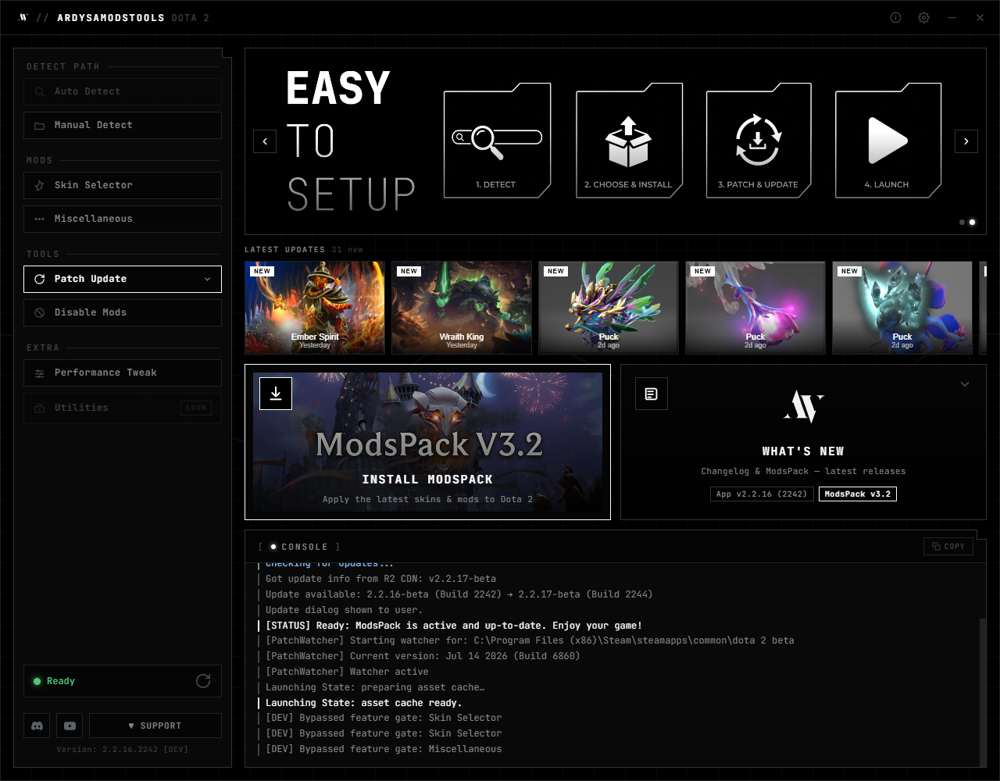
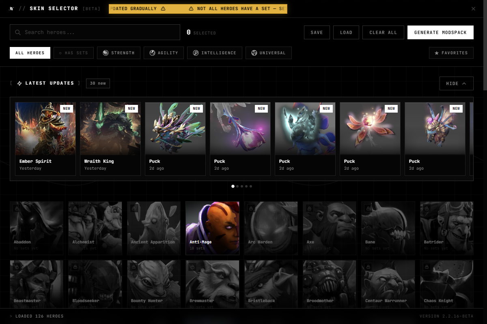
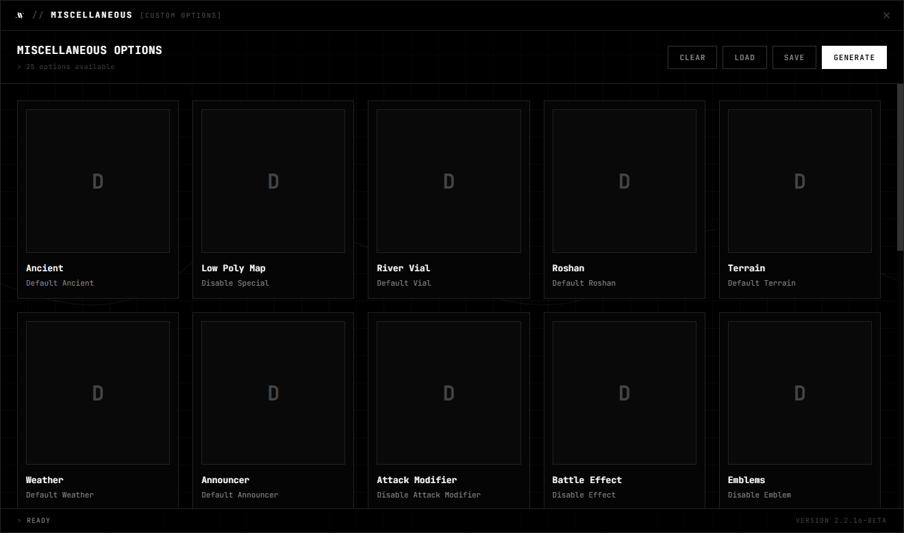

# ArdysaModsTools User Guide

**Version 2.1.22-beta** | The Ultimate Dota 2 Mod Manager

---

## Table of Contents

1. [What is ArdysaModsTools?](#what-is-ardysamodstools)
2. [System Requirements](#system-requirements)
3. [Installation](#installation)
4. [Getting Started](#getting-started)
5. [Features Overview](#features-overview)
6. [Main Features](#main-features)
   - [Mod Installation](#mod-installation)
   - [Hero Set Generation](#hero-set-generation)
   - [Miscellaneous Mods](#miscellaneous-mods)
7. [Advanced Features](#advanced-features)
8. [Troubleshooting](#troubleshooting)
9. [FAQ](#faq)
10.   [Support & Community](#support--community)

---

## What is ArdysaModsTools?

**ArdysaModsTools (AMT 2.0)** is a powerful Windows desktop application designed to help Dota 2 players easily install and manage custom cosmetic modifications. With AMT 2.0, you can:

- 🎮 **Install curated mod packs** with one click
- 🦸 **Create custom hero skins** from community sets
- 🌦️ **Customize weather, terrain, and HUD** elements
- 🔄 **Keep mods working** after game updates
- 🔧 **Auto-detect** your Dota 2 installation

> [!IMPORTANT]
> This tool **only modifies cosmetic elements** and does not affect gameplay. Use at your own risk. Always backup your game files before modding.

---

## System Requirements

| Component            | Requirement                                                                                                           |
| -------------------- | --------------------------------------------------------------------------------------------------------------------- |
| **Operating System** | Windows 10/11 (64-bit)                                                                                                |
| **Runtime**          | Bundled (self-contained — no separate .NET install needed)                                                            |
| **Browser Runtime**  | [WebView2 Runtime](https://developer.microsoft.com/microsoft-edge/webview2/) (usually pre-installed on Windows 10/11) |
| **Disk Space**       | 500 MB free (for temporary files)                                                                                     |
| **Dota 2**           | Installed via Steam                                                                                                   |

> [!NOTE]
> The app is self-contained — the .NET 8 runtime is bundled with the installer. No separate runtime installation is needed.

---

## Installation

### Download & Install

1. **Download the Installer**
   - Get `ArdysaModsTools_Setup_x64.exe` from the official source

2. **Run the Installer**
   - Right-click the installer and select **Run as Administrator**
   - Follow the installation wizard

3. **Dependency Check**
   - The installer will check for .NET 8 Desktop Runtime
   - If not found, you'll be prompted to download it
   - After installing .NET 8, run the AMT installer again

4. **Complete Installation**
   - Choose installation location (default: `%LocalAppData%\ArdysaModsTools`)
   - Optionally create a desktop shortcut
   - Click **Install**

5. **Launch Application**
   - Check **Launch ArdysaModsTools** at the end of installation
   - Or launch from Start Menu or Desktop shortcut

> [!WARNING] > **Important**: Close Dota 2 completely before launching ArdysaModsTools. The application cannot run while Dota 2 is active.

### Updating

When a new version is available:

- The application will notify you automatically
- Download the new installer
- The installer will automatically remove the old version before installing the new one

---

## Getting Started

### First Launch & Onboarding Guide

When you first launch ArdysaModsTools, the **Newcomer Onboarding Guide** will automatically trigger. This interactive step-by-step visual spotlight highlights each critical control on the main dashboard to help you get situated.

The guide will walk you through:
1. **Auto Detect / Manual Detect**: Finding your Dota 2 installation.
2. **Skin Selector & Miscellaneous**: Navigating to mod categories.
3. **Install & Patch Update**: Applying and maintaining your mods.
4. **Console Logs & Settings**: Inspecting errors and clearing caches.

*Note: You can re-run the Onboarding Guide anytime from the Settings page by clicking the "Show Guide" button.*

#### Step 1: Detect Dota 2 Installation

The application needs to know where Dota 2 is installed on your computer.

**Option A: Auto Detect (Recommended)**

1. Click the **Auto Detect** button
2. The app will search common locations and Steam libraries
3. If found, the path will appear in the target path field
4. Status will show "Detected successfully"

**Option B: Manual Selection**

1. Click the **Manual Select** button
2. Navigate to your Dota 2 installation folder
   - Default: `C:\Program Files (x86)\Steam\steamapps\common\dota 2 beta`
3. Select the `dota 2 beta` folder
4. Click **OK**

> [!TIP]
> If auto-detection fails, your Dota 2 might be installed in a custom Steam library. Use manual selection to locate it.

#### Step 2: Install Mods

Once Dota 2 is detected:

1. Click the **Install** button
2. Choose installation method:
   - **Auto Install**: Download the latest mod pack from the server (recommended)
   - **Manual Install**: Use a VPK file you already have
3. Wait for the installation to complete
4. Status will show "Ready" in green when successful

#### Step 3: Launch Dota 2

The mods are now installed! Launch Dota 2 normally and enjoy your customized game.

---

## Features Overview

ArdysaModsTools offers four core features:

| Feature               | Description                                  | Access Point |
| --------------------- | -------------------------------------------- | ------------ |
| **Install Mods**      | Download and install the main mod pack       | Main Button (Blue) |
| **Select Hero**       | Create custom hero skins from community sets | Main Button (Purple) |
| **Miscellaneous**     | Customize weather, terrain, HUD, and more    | Main Button (Orange) |
| **Performance Tweak** | Optimize Dota 2 cvar & autoexec settings     | Header Icon (🔧) |

---

## Main Features

### Mod Installation

The primary feature is installing curated mod packs that include multiple cosmetic enhancements.

#### Installing Mods

1. **Click Install** button
2. **Choose Auto Install** for the latest mods from the server
3. The application will:
   - Download the latest ModsPack
   - Validate the VPK file
   - Copy to your Dota 2 folder (`game/dota/_ArdysaMods/`)
   - Patch game configuration files for mod compatibility
4. Monitor progress in the console at the bottom
5. When complete, status shows **Ready** (green)

#### Auto Install vs Manual Install

**Auto Install**:

- Always gets the latest version
- Automatic validation
- Recommended for most users

**Manual Install**:

- Use if you have a specific VPK file
- Must contain `_ArdysaMods` marker to be valid
- Useful for offline installation

#### Disabling Mods

To temporarily disable mods without uninstalling:

1. Click the **Disable** button
2. This will restore original game configuration
3. Mod files remain in place
4. Click **Install** again to re-enable

#### Updating Mods

When game updates or new mod versions are available:

1. Status indicator will show **Need Update** (orange)
2. Click the **Patch Update** button
3. The patch will update signatures and game configuration

> [!IMPORTANT]
> After each Dota 2 game update, run **Patch Update** to ensure mods continue working properly.

---

### Hero Set Generation

Create custom hero skins by selecting from community-created cosmetic sets.

#### How It Works

The Hero Set Generator:

1. Downloads base game files
2. Merges custom set assets (models, textures, particles)
3. Patches item definitions
4. Recompiles into a VPK file
5. Replaces the original

#### Using Hero Set Generation

1. **Click Select Hero** button from the main window.
2. **Browse Heroes**:
   - Scroll through the grid of hero portraits.
   - Use the search bar to find specific heroes.
   - Click the star icon to favorite heroes (favorites stay pinned to the top).
3. **Configure Customization Layers**:
   When you click on a hero card, a modal will show the available options divided into categories:
   * **Legacy Sets**: Classical, curated full-body hero sets from the server.
   * **Custom Sets**: Mixed set variations compiled by the community.
   * **Items**: Individual cosmetic items (e.g., custom weapons, shoulders).
   * **Base Heroes**: Basic default model modifications.
   * **Persona** *(Magenta/Pink themed)*: Full model replacement sets (e.g., Baby Invoker, female Anti-Mage).

4. **Mutual Exclusion & Slot Verification**:
   * **Slot Tag Exclusion**: Selecting an individual item automatically deselects any currently active item that shares the same slot tag (e.g., you cannot equip two weapons). Equipped items display their slot tags as green badges (e.g., `[shoulder]`, `[weapon]`).
   * **Persona Exclusion**: Selecting a **Persona** acts as a full model override. It will automatically clear and disable all individual Items and Base Hero selections for that hero to prevent model clipping and crashes.
5. **Add Multiple Heroes**:
   - Select sets and customizations for as many heroes as you like.
6. **Generate**:
   - Click the **Generate** button.
   - The priorities in the merging pipeline are automatically handled: `Set / Custom Set / Persona → Selected Items → Base Hero` (so base hero overrides items, and items override sets/personas).
   - Monitor progress via the sidebar preview panel on the progress overlay.

#### Batch Generation

You can generate multiple heroes at once:

- Select sets for multiple heroes
- Click **Generate**
- The application processes them sequentially
- Progress bar shows overall completion

#### Favorites System

Mark frequently used heroes as favorites:

- Click the star icon on any hero card
- Favorites appear at the top of the list
- Easier access to your preferred heroes

> [!TIP]
> Hero set generation can take 2-5 minutes per hero depending on set size. Plan accordingly when generating multiple heroes.

---

### Miscellaneous Mods

Customize additional game elements beyond hero skins.

#### Available Categories

**🌦️ Weather Effects**

- Moonbeam
- Aurora
- Snow
- Ash
- Pestilence
- And more...

**🗺️ Terrain/Map**

- Custom map skins
- Different visual themes

**🎨 HUD Modifications**

- Interface customizations
- UI element replacements

**⚔️ Battle Effects**

- TI-themed kill/ability effects (Aghanim, Nemestice, TI 2015–2022)

**🐴 Courier**

- Custom courier skins with style support
- Up to 2 ethereal particle effects per courier

**🔮 Ward**

- Custom ward skins with model extraction
- Style variants and particle effects

**🔊 Audio Mods**

- Custom music packs

**🎯 Cursor**

- Custom cursor skins

**⭐ Special**

- Full ZIP-based mod packs (e.g., LowPoly Map)
- Mutual exclusion with Map option

#### Using Miscellaneous Mods

1. **Click Miscellaneous** button from main window
2. **Choose Generation Mode**:
   - **Clean Generate**: Start fresh, replaces all existing misc mods
   - **Add to Current**: Merge with existing modifications
3. **Select Options**:
   - Browse through categories
   - Check boxes or select from dropdowns
   - Multiple selections allowed
4. **Apply Changes**:
   - Click **Generate** or **Apply** button
   - Wait for compilation
   - Status will confirm completion

#### Generation Modes Explained

| Mode               | When to Use                        | Effect                                         |
| ------------------ | ---------------------------------- | ---------------------------------------------- |
| **Clean Generate** | First time, or reset all changes   | Extracts fresh VPK, applies only selected mods |
| **Add to Current** | Adding more mods to existing setup | Uses existing extraction, adds new mods        |

> [!NOTE]
> Clean Generate takes longer but ensures a clean slate. Use Add to Current for quick additions.

---

### 🔧 Performance Tweak (Autoexec Optimizer)

Optimize Dota 2 launch parameters and custom game settings to get the maximum frames per second (FPS) and minimum latency.

#### How to Use

1. Click the **Tweak** (🔧) button located in the top-right corner of the MainForm header.
2. This opens the **Performance Tweaker** dialog.
3. Configure your settings across these tabs:
   * **FPS & Display**: Cap gameplay and UI frame rates, modify viewport scaling, and set screen brightness.
   * **Visual Toggles**: Enable/disable expensive rendering options (e.g., portrait animations, normal maps, grass quality, wind effects on trees, and ambient creatures) to boost FPS.
   * **Quality**: Customize texture streaming mip bias and particle fallback modes.
   * **Engine Tweaks**: Adjust particle simulation limits and disable background sleeps.
   * **VSync & Latency**: Optimize latency sleeps and lag limiters.
   * **Network**: Adjust transmission rate, cl_updaterate, and cl_interp_ratio to improve connection stability.
4. Click **Apply Settings** to save these CVAR configurations directly to `autoexec.cfg` in your game files. AMT saves this file using atomic file transactions to prevent config corruption.
5. You can also export the settings to a custom `.cfg` file using the **Export Config** option.

---

## Advanced Features

### Patch Management

After Dota 2 game updates, some files may need re-patching:

1. **Automatic Detection**:
   - Application checks mod status on launch
   - Status indicator shows:
      - **Ready** (Green): Everything working
      - **Need Update** (Orange): Patch required
      - **Error** (Red): Issue detected

2. **Manual Patching**:
   - Click **Patch Update** button
   - The patch will update signatures and game configuration

### Verification

To verify mod installation integrity:

1. Right-click the **Patch Update** button
2. Select **Verify Mod Files**
3. The application checks:
   - Presence of all required files
   - VPK integrity
   - Configuration patches
4. View detailed status report

### Console Logs

The console at the bottom shows real-time operation logs:

- Download progress
- File operations
- Errors and warnings
- Completion status

**Copy Logs**:

- Click the **Copy** button above console
- Paste logs when reporting issues

### Clear Temp Files

To free up disk space:

- The application stores temporary files during operations
- These are automatically cleaned on exit
- Manual cleanup happens during reinstall

---

## Troubleshooting

### Common Issues

#### Issue: Can't Launch Application

**Error**: "Cannot run while dota2.exe is active"

**Solution**:

- Close Dota 2 completely
- Check Task Manager for `dota2.exe` process
- End the process if found
- Launch AMT again

---

#### Issue: Auto Detect Fails

**Error**: "Could not detect Dota 2"

**Solutions**:

1. Use **Manual Select** instead
2. Check Dota 2 is installed via Steam
3. Verify installation by launching Dota 2 from Steam
4. Try detecting again after verifying

---

#### Issue: Installation Fails

**Error**: Various installation errors

**Solutions**:

1. **Run as Administrator**: Right-click app icon → Run as Administrator
2. **Check Disk Space**: Ensure at least 500MB free
3. **Disable Antivirus**: Temporarily disable if blocking VPK operations
4. **Verify Dota 2**: Right-click Dota 2 in Steam → Properties → Local Files → Verify Integrity
5. **Check Logs**: Copy console logs and see specific error

---

#### Issue: Mods Not Visible In-Game

**Problems**: Installed mods don't appear in Dota 2

**Solutions**:

1. **Check Status**: Status should show "Ready" (green)
2. **Run Patch**: Click Patch Update
3. **Restart Dota 2**: Completely exit and relaunch
4. **Verify Installation**:
   - Check folder exists: `dota 2 beta/game/dota/_ArdysaMods/`
   - Check `pak01_dir.vpk` is present
5. **Reinstall**: Click Disable, then Install again

---

#### Issue: Game Update Breaks Mods

**Problem**: After Dota 2 update, mods stop working

**Solution**:

1. Launch AMT
2. Status will show "Need Update" (orange)
3. Click **Patch Update**
4. Wait for completion
5. Relaunch Dota 2

---

#### Issue: .NET 8 Not Found

**Error**: "Requires .NET 8 Desktop Runtime"

**Solution**:

1. Click **Yes** when prompted to download
2. Download from: https://dotnet.microsoft.com/download/dotnet/8.0
3. Install **Desktop Runtime (x64)**
4. Run AMT installer again

---

### Performance Issues

#### Slow Generation

Hero set generation taking very long:

**Causes**:

- Large set files
- Slow internet connection (for downloads)
- Antivirus scanning VPK operations

**Solutions**:

- Be patient (2-5 minutes per hero is normal)
- Ensure stable internet connection
- Exclude AMT folder from antivirus scanning
- Close other applications

---

### Error Messages

| Error          | Meaning                | Solution                              |
| -------------- | ---------------------- | ------------------------------------- |
| `VPK_001`      | VPK extraction failed  | Verify tools folder exists            |
| `VPK_002`      | VPK compilation failed | Check permissions, try as admin       |
| `DOWNLOAD_001` | Download failed        | Check internet, retry                 |
| `PATCH_001`    | Gameinfo patch failed  | Verify Dota 2 installation            |
| `GEN_001`      | Hero generation failed | Check specific hero, try individually |

> [!TIP]
> Always copy console logs when reporting errors. Click the **Copy Console** button and paste when asking for help.

---

## FAQ

### 🛡️ Ban & Safety Questions

#### ❓ Will I get VAC banned for using AMT?

> [!IMPORTANT]
> **Short answer: No known bans from cosmetic mods, but use at your own risk.**

Here's what AMT does and does **NOT** do:

| AMT Does ✅                                | AMT Does NOT ❌                              |
| ------------------------------------------ | -------------------------------------------- |
| Modify local cosmetic VPK files            | Inject into game processes or memory         |
| Patch `gameinfo.gi` for mod loading        | Interact with VAC or anti-cheat systems      |
| Replace textures, models, particles        | Connect to Valve's online services           |
| Work only when Dota 2 is **closed**        | Modify game behavior or give advantages      |
| Store all changes in `_ArdysaMods/` folder | Touch any files outside the Dota 2 directory |

**Why it's considered safe:**

1. **Client-side only** — Other players cannot see your mods
2. **File-based modifications** — No process injection, no DLL hooking, no memory editing
3. **VAC targets cheats** — VAC detects runtime modifications (wallhacks, aimbots, memory hacks). File-based cosmetic mods do not trigger VAC
4. **Fully reversible** — Click "Disable Mods" to instantly restore vanilla Dota 2
5. **Historical precedent** — Cosmetic file mods have been used by the Dota 2 community for years without VAC bans

> [!CAUTION]
> **Valve's policies can change at any time.** While there have been no known bans for cosmetic-only file mods, Valve has the right to change their Terms of Service. AMT's authors are not responsible for any account actions.

---

#### ❓ Is this a cheat or a hack?

**No.** AMT is a cosmetic mod manager. It:

- Does **not** give any gameplay advantage
- Does **not** modify game logic, abilities, or mechanics
- Does **not** show hidden information (enemy positions, cooldowns, etc.)
- Only changes what **you** see on your screen (hero skins, weather, terrain, HUD)

---

#### ❓ Can other players see my mods?

**No.** All modifications are **client-side only**. Other players see the default game assets. Your mods only affect your local game rendering.

---

#### ❓ Can Valve detect that I'm using mods?

AMT modifies files in the game directory, which is something Dota 2 naturally reads on launch. However:

- AMT does **not** run while Dota 2 is active
- No hooks, injections, or runtime modifications occur
- The modifications are identical in nature to how custom games and workshop content work

---

#### ❓ What if Valve bans cosmetic mods in the future?

If Valve changes their policy:

1. Click **"Disable Mods"** in AMT to instantly restore vanilla Dota 2
2. Or verify game files via Steam: _Right-click Dota 2 → Properties → Local Files → Verify integrity of game files_
3. All changes are fully reversible with zero trace

---

#### ❓ Is AMT open-source? Can I trust it?

Yes. AMT is fully open-source under the **GNU General Public License v3.0**. The complete source code is available on [GitHub](https://github.com/Anneardysa/ArdysaModsTools). You can audit every line of code.

---

### 🎮 Usage

#### ❓ How do I install AMT?

1. Download `ArdysaModsTools_Setup_x64.exe` from [GitHub Releases](https://github.com/Anneardysa/ArdysaModsTools/releases)
2. **Close Dota 2** completely
3. Run the installer as **Administrator**
4. Follow the setup wizard
5. Launch AMT from Desktop or Start Menu

---

#### ❓ How do I detect my Dota 2 installation?

- **Auto Detect** (recommended): Click the "Auto Detect" button — AMT searches common Steam library paths
- **Manual Select**: If auto-detection fails, click "Manual Select" and browse to your `dota 2 beta` folder
   - Default path: `C:\Program Files (x86)\Steam\steamapps\common\dota 2 beta`

---

#### ❓ How do I install the mod pack?

1. Click **"Install"** button
2. Choose **"Auto Install"** (downloads latest mod pack from CDN)
3. Wait for download, validation, and installation
4. Status shows **"Ready" (green)** when complete
5. Launch Dota 2 and enjoy!

---

#### ❓ My mods stopped working after a Dota 2 update. What do I do?

This is **normal behavior**. Dota 2 updates overwrite modded files.

**Fix:**

1. Open AMT
2. Status will show **"Need Update" (orange)**
3. Click **"Patch Update"**
4. Wait for completion
5. Relaunch Dota 2

> [!TIP]
> Enable **PatchWatcher** to get automatic notifications when Dota 2 updates are detected.

---

#### ❓ How do I create custom hero skins?

1. Click **"Skin Selector"** from the main window
2. Browse or search for heroes
3. Click a hero card and choose a cosmetic set from the dropdown
4. Repeat for as many heroes as you want
5. Click **"Generate"**
6. Wait 2–5 minutes per hero

---

#### ❓ Can I select multiple heroes at once?

**Yes!** Select sets for as many heroes as you want before clicking "Generate". The app processes them sequentially.

---

#### ❓ How do I favorite heroes?

Click the **star icon** on any hero card. Favorites appear at the top of the list for quick access.

---

#### ❓ What misc mods are available?

| Category           | Examples                                |
| ------------------ | --------------------------------------- |
| **Weather**        | Moonbeam, Aurora, Snow, Ash, Pestilence |
| **Terrain**        | TI terrains, seasonal maps              |
| **HUD**            | Custom interface themes and overlays    |
| **Battle Effects** | TI-themed ability/kill effects          |
| **Music**          | Custom music packs                      |
| **Cursor**         | Custom cursor skins                     |

---

#### ❓ What's the difference between "Clean Generate" and "Add to Current"?

| Mode               | Use When                     | Effect                               |
| ------------------ | ---------------------------- | ------------------------------------ |
| **Clean Generate** | First time or resetting all  | Fresh extraction, only selected mods |
| **Add to Current** | Adding more mods to existing | Merges with current mods (faster)    |

---

#### ❓ How do I temporarily disable mods?

Click **"Disable Mods"** in AMT. This restores original game configuration. Mod files remain on disk — click "Install" to re-enable.

---

#### ❓ How do I completely remove all mods?

1. Click **"Disable"** in AMT
2. Optionally verify game files via Steam: _Steam → Right-click Dota 2 → Properties → Local Files → Verify integrity_
3. Optionally delete the `_ArdysaMods` folder in your Dota 2 installation

---

#### ❓ How do I uninstall AMT itself?

1. Click **"Disable"** in AMT to restore vanilla Dota 2
2. Uninstall via _Windows Settings → Apps → ArdysaModsTools → Uninstall_
3. Optionally delete residual folders in `%AppData%\ArdysaModsTools`

---

### 🔧 Troubleshooting

#### ❓ AMT won't start / shows a WebView2 error

**Cause:** Missing WebView2 Runtime

**Fix:** Install the [WebView2 Runtime](https://developer.microsoft.com/microsoft-edge/webview2/). It's usually pre-installed on Windows 10/11 but may be missing on some systems.

---

#### ❓ AMT says ".NET 8 not found"

**Fix:**

1. Download from [dotnet.microsoft.com](https://dotnet.microsoft.com/download/dotnet/8.0)
2. Install the **.NET 8 Desktop Runtime (x64)**
3. Run the AMT installer again

---

#### ❓ AMT says "Cannot run while dota2.exe is active"

**Fix:**

1. Close Dota 2 completely
2. Open Task Manager (`Ctrl+Shift+Esc`)
3. Look for `dota2.exe` and end the process if found
4. Relaunch AMT

---

#### ❓ AMT is flagged by my antivirus

**This is a false positive.** AMT manipulates VPK files which triggers some antivirus heuristics.

**Fix:**

1. Add an exception for your AMT installation folder
2. Add an exception for `cdn.ardysamods.my.id` in your firewall
3. Download only from the [official GitHub releases](https://github.com/Anneardysa/ArdysaModsTools/releases)

---

#### ❓ Dota 2 is not detected / "Could not detect Dota 2"

**Fixes (try in order):**

1. Run AMT **as Administrator**
2. Click **"Manual Select"** and browse to: `C:\Program Files (x86)\Steam\steamapps\common\dota 2 beta`
3. If Dota 2 is in a custom Steam library, browse to that location instead
4. Verify Dota 2 is installed by launching it from Steam

---

#### ❓ Installation fails with "Access Denied"

**Causes & Fixes:**

| Cause               | Fix                                    |
| ------------------- | -------------------------------------- |
| Dota 2 is running   | Close Dota 2 completely                |
| No write permission | Run AMT as **Administrator**           |
| Antivirus blocking  | Temporarily disable real-time scanning |
| Disk space full     | Free up at least 500 MB–2 GB of space  |

---

#### ❓ Mods installed but not visible in-game

**Fixes (try in order):**

1. Check status shows **"Ready" (green)** in AMT
2. Click **"Patch Update"**
3. **Completely exit** Dota 2 and relaunch (don't just reconnect)
4. Verify the folder exists: `dota 2 beta/game/dota/_ArdysaMods/`
5. Click **"Disable"** and then **"Install"** again for a fresh install

---

#### ❓ Download fails or stalls

**Fixes:**

1. Check your internet connection
2. AMT uses multi-CDN fallback (Cloudflare R2 → jsDelivr → GitHub Raw) — it will retry automatically
3. If CDN is blocked in your region, try changing DNS to `8.8.8.8` or `1.1.1.1`
4. Whitelist `cdn.ardysamods.my.id` in your firewall

---

#### ❓ "Signature Mismatch" after Dota 2 update

**This is normal!** Dota 2 updates change file signatures.

**Fix:** Click **"Patch Update"** → Wait for completion → Launch Dota 2

---

#### ❓ VPK recompilation fails

**Fixes:**

1. Ensure the `tools/` folder has all required files (HLExtract.exe, vpk.exe)
2. Delete the `_ArdysaMods/_temp/` folder and retry
3. Free up disk space (~2 GB needed for extraction)
4. Verify game files via Steam

---

#### ❓ "Connection to server failed" in Skin Selector

**Causes & Fixes:**

| Cause             | Fix                                                   |
| ----------------- | ----------------------------------------------------- |
| CDN blocked       | Update to latest AMT version (uses R2 CDN + fallback) |
| Firewall blocking | Whitelist `cdn.ardysamods.my.id`                      |
| DNS issues        | Change DNS to `8.8.8.8` or `1.1.1.1`                  |
| Rate limiting     | Wait 1 hour, then retry                               |

**Check console logs for specific errors:**

- `[NET] Timeout` → Slow connection, retry
- `[NET] Server returned 403` → Rate limited, wait
- `[NET] Connection failed` → Network issue, check firewall

---

### 💡 Tips & Best Practices

### Do's ✅

1. **Always close Dota 2** before using AMT
2. **Run as Administrator** for best compatibility
3. **Click "Patch Update"** after every Dota 2 game update
4. **Star favorite heroes** for quick access in Skin Selector
5. **Copy console logs** when reporting bugs (use the Copy button)
6. **Keep AMT updated** — newer versions have better CDN support and bug fixes
7. **Download only from official sources** — [GitHub Releases](https://github.com/Anneardysa/ArdysaModsTools/releases)

### Don'ts ❌

1. **Don't** run AMT while Dota 2 is open
2. **Don't** manually edit files in `_ArdysaMods/` folder
3. **Don't** download AMT from unofficial sources
4. **Don't** share modified game files with others
5. **Don't** run multiple instances of AMT

### Pro Tips 💎

- **Batch generate** — Select sets for multiple heroes before clicking Generate to save time
- **Use "Add to Current"** when adding a single misc mod (faster than Clean Generate)
- **Enable PatchWatcher** — Automatically detects Dota 2 updates so you never play with broken mods
- **Backup favorites** — Your favorites and settings are stored in `%AppData%\ArdysaModsTools`

---

### 📊 Quick Reference

### Status Indicators

| Color     | Status        | Meaning                    | Action Needed        |
| --------- | ------------- | -------------------------- | -------------------- |
| 🟢 Green  | Ready         | Mods installed and working | None — enjoy!        |
| 🟠 Orange | Need Update   | Patch required             | Click "Patch Update" |
| ⚫ Gray   | Not Installed | No mods installed          | Click "Install"      |
| 🔴 Red    | Error         | Problem detected           | Check console logs   |

### Console Log Patterns

| Pattern   | Meaning                      |
| --------- | ---------------------------- |
| `[VPK]`   | VPK extraction/recompilation |
| `[NET]`   | Network operations           |
| `[PATCH]` | Signature patching           |
| `[GEN]`   | Hero/misc generation         |

---

### General

**Q: Does this work with Mac/Linux?**  
A: No, AMT 2.0 is Windows-only. It requires Windows 10/11 (64-bit) and .NET 8.

**Q: Can I use this on Dota 2 Reborn?**  
A: Yes, AMT 2.0 is designed for the current version of Dota 2 (Source 2/Reborn).

**Q: Is this free?**  
A: Yes, ArdysaModsTools is completely free. Donations are appreciated to support development.

---

### Technical

**Q: Where are mods installed?**  
A: Mods are installed in: `dota 2 beta/game/dota/_ArdysaMods/pak01_dir.vpk`

**Q: Where are logs saved?**  
A: Logs are in: `[Dota 2 Path]/game/_ArdysaMods/_temp/logs/`

**Q: Where are settings saved?**  
A: Settings are in: `%AppData%\ArdysaModsTools` (favorites, user preferences, and configuration files)

**Q: Can I backup my mods?**  
A: Yes, backup the `_ArdysaMods` folder and your AMT settings folder.

**Q: How do I completely uninstall?**  
A:

1. Click **Disable** in AMT to restore original files
2. Uninstall via Windows Settings → Apps
3. Optionally delete the `_ArdysaMods` folder in your Dota 2 installation

---

### Features

**Q: Can I use multiple hero sets at once?**  
A: Yes! That's the main benefit. Select different sets for different heroes and generate them all.

**Q: Can I mix hero sets with misc mods?**  
A: Yes, they work independently. Hero sets modify `pak01_dir.vpk`, misc mods also use the same VPK but different content.

**Q: How do I reset to vanilla Dota 2?**  
A: Click **Disable** button to restore original configuration. Or right-click Dota 2 in Steam → Properties → Verify Integrity of Game Files.

**Q: Can I use custom sets not in the list?**  
A: Not directly through AMT. The app uses curated sets from the CDN. Manual modding requires technical knowledge.

**Q: What happens if I select multiple sets for the same hero?**  
A: The last selected set for each hero is used. Each hero can only have one active set at a time.

---

## Support & Community

### Get Help

If you encounter issues or have questions:

1. **Check this guide** - Most questions are answered here
2. **Check console logs** - Often show what went wrong
3. **Join Discord** - Community support and discussions
4. **Watch tutorials** - YouTube channel has video guides

### Links

- 💬 **Discord Server**: [discord.gg/ffXw265Z7e](https://discord.gg/ffXw265Z7e)
- 📺 **YouTube Channel**: [youtube.com/@ardysa](https://youtube.com/@ardysa)
- ☕ **Support Development**: [ko-fi.com/ardysa](https://ko-fi.com/ardysa)

### Reporting Bugs

When reporting bugs, include:

1. **AMT version** - Shown in title bar
2. **Windows version** - Windows 10/11
3. **Dota 2 version** - From Dota 2 main menu
4. **Console logs** - Copy from console
5. **Steps to reproduce** - What you did before the error
6. **Screenshots** - If relevant

### Feature Requests

Have an idea? Request features in:

- Discord suggestions channel
- YouTube video comments
- Community forums

---

## Credits & License

### Development

**ArdysaModsTools** is developed and maintained by **Ardysa**.

### License

This software is licensed under the **GNU General Public License v3.0**.  
See LICENSE for full details.

### Third-Party Tools

AMT uses:

- **HLExtract** - VPK extraction (HLLib)
- **vpk.exe** - VPK compilation (Valve)
- Various .NET libraries (see LICENSE.txt)

---

## Disclaimer

> [!CAUTION] > **Important Disclaimer**
>
> This tool modifies Dota 2 game files. While it only changes cosmetic elements:
>
> - Use at your own risk
> - The developers are not responsible for any issues
> - This includes game bans, corrupted files, or data loss
> - Always backup your files before modding
> - Valve's policy on mods may change at any time

**By using ArdysaModsTools, you acknowledge and accept these risks.**

---

## Quick Reference Card

### Essential Shortcuts

| Action                | Steps                                           |
| --------------------- | ----------------------------------------------- |
| **First Time Setup**  | Auto Detect → Install → Launch Dota 2           |
| **Install Mods**      | Install button → Auto Install → Wait            |
| **Disable Mods**      | Disable button → Confirm                        |
| **After Game Update** | Patch Update                                    |
| **Create Hero Skin**  | Select Hero → Pick hero → Choose set → Generate |
| **Add Misc Mods**     | Miscellaneous → Select options → Generate       |
| **Verify Mods**       | Right-click Patch Update → Verify               |
| **Get Logs**          | Click Copy Console button                       |

### Status Indicators

| Color     | Status        | Meaning                    |
| --------- | ------------- | -------------------------- |
| 🟢 Green  | Ready         | Mods installed and working |
| 🟠 Orange | Need Update   | Patch required             |
| ⚫ Gray   | Not Installed | No mods installed          |
| 🔴 Red    | Error         | Problem detected           |

---

**Thank you for using ArdysaModsTools! Enjoy your customized Dota 2 experience! 🎮**

_Version 2.1.22-beta_
